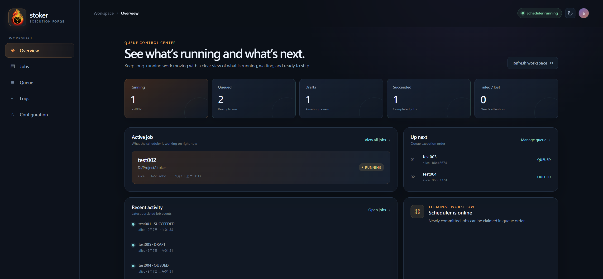
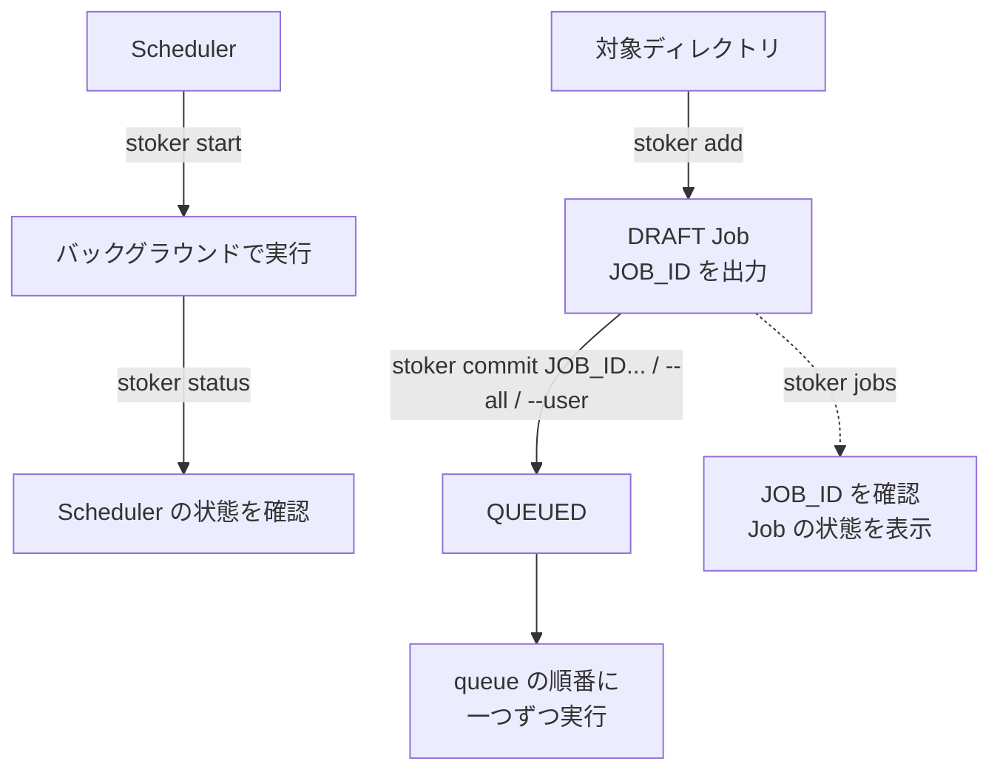

<h1 align="center">
  
</h1>
<br>

[](https://www.rust-lang.org/)

[](https://github.com/qinodes/stoker/actions/workflows/ci.yml)
[](https://codecov.io/gh/qinodes/stoker)
[](https://crates.io/crates/stoker-engine)
[](https://crates.io/crates/stoker-engine)
[](https://github.com/qinodes/stoker/blob/main/LICENSE)

[English](README.md) | [繁體中文](README.zh-TW.md) | 日本語

**stoker は、複数の時間のかかる仕事をスケジュールするための、軽量でクロスプラットフォームな CLI です。**

複数の時間のかかるタスクを、順番に安定して実行するために設計されています。

Stoker は Job の状態とログをローカルの SQLite に保存します。Redis、PostgreSQL、その他の外部データベースは必要ありません。

- 複数人で共有しながら、タスク同士のリソース競合を避けたい場合に適しています。

- 複数のユーザーが同時にスケジュールタスクを登録できます。

- 各 Job はデフォルトで、コマンドを登録したディレクトリ（`stoker add` を実行した場所）から実行されます。

## Web UI デモ

<p align="center">
  
</p>

Web UI では、DRAFT Job の作成と確認、説明の編集、Job の commit／cancel、Queue の管理、ログの表示、タイムゾーンと設定スナップショットの管理ができます。

```bash
stoker start
stoker ui start --open
```

アドレスの確認には `stoker ui status`、UI server の停止には `stoker ui stop` を使用します。デフォルトでは `127.0.0.1:8765` のみで待ち受けます。

ローカルネットワークからアクセスできるようにする場合は、loopback 以外のアドレスを明示的に指定します。

```bash
stoker ui start --host 0.0.0.0 --port 8765
```

LAN モードでは追加の token 認証を行いません。信頼できるネットワークでのみ loopback 以外のアドレスにバインドしてください。

## インストール

### ワンラインインストーラー（推奨）

インストーラーは最新 release をダウンロードして SHA256 を検証し、Stoker を現在のユーザー用ディレクトリにインストールして、ユーザーの `PATH` に永続的に追加します。管理者権限は必要ありません。

**Windows PowerShell:**

```powershell
irm https://github.com/qinodes/stoker/releases/latest/download/stoker-install.ps1 | iex
```

`%LOCALAPPDATA%\Programs\stoker` にインストールされます。

**Linux／macOS:**

```bash
curl --proto '=https' --tlsv1.2 -LsSf https://github.com/qinodes/stoker/releases/latest/download/stoker-install.sh | sh
```

`~/.local/bin` にインストールされます。現在の release は Linux x86_64 と macOS Apple Silicon に対応しています。

特定の公開バージョンをインストールする場合は、URL の `latest` を release tag に置き換えます。

```powershell
irm https://github.com/qinodes/stoker/releases/download/v1.2.3/stoker-install.ps1 | iex
```

```bash
curl --proto '=https' --tlsv1.2 -LsSf https://github.com/qinodes/stoker/releases/download/v1.2.3/stoker-install.sh | sh
```

### 手動インストール

[GitHub Releases](https://github.com/qinodes/stoker/releases) から環境に合うアーカイブをダウンロードし、`stoker` 実行ファイルを展開して、そのディレクトリを `PATH` に追加してください。

- Windows: `stoker-windows-x86_64.zip`
- Linux: `stoker-linux-x86_64.tar.gz`
- macOS Apple Silicon: `stoker-macos-arm64.tar.gz`

ダウンロードした実行ファイルは環境変数に自動で追加されません。実行ファイルのあるディレクトリを `PATH` に追加してください。

**Windows:** 「環境変数」の「ユーザー環境変数」で `Path` を編集し、実行ファイルのあるディレクトリを追加してから、ターミナルを再起動します。

**macOS／Linux:** `/path/to/stoker` を実行ファイルのある実際のディレクトリに置き換え、次の内容を `~/.zshrc`（macOS）または `~/.bashrc`（Linux）に追加してから、ターミナルを再起動します。

```bash
export PATH="/path/to/stoker:$PATH"
```

書き込んだ後、現在のターミナルにすぐ反映する場合は、次を実行します。

```bash
source ~/.bashrc  # Linux
source ~/.zshrc   # macOS
```

各 release には、プラットフォーム用の実行ファイルと `SHA256SUMS` も含まれます。

### Cargo がインストール済みの場合

```bash
cargo install stoker-engine
```

## クイックスタート

### 基本的な流れ

```bash
# scheduler をバックグラウンドで起動
stoker start

# scheduler の状態を確認
stoker status

# タスクの実行に必要なルートディレクトリで DRAFT Job を作成
# stoker add は JOB_ID を出力します
stoker add --user alice --name exp-a --cmd "python train.py --lr 0.0001"

# stoker add が出力した JOB_ID を使って Job を queue に追加
# JOB_ID は stoker jobs でも確認できます
stoker commit <JOB_ID>

# または、すべての DRAFT Job を作成時間順に queue へ追加
stoker commit --all

# または、指定した論理ユーザーのすべての DRAFT Job を queue へ追加
stoker commit --user alice

# すべての Job と現在の状態を一覧表示
stoker jobs
```



`--user` は stoker の論理的な owner ラベルであり、OS アカウントや認証機能ではありません。

### コマンドリファレンス

```bash

# scheduler をバックグラウンドで起動（Linux、macOS、Windows）
stoker start

# 対象ディレクトリで DRAFT Job を作成
stoker add --user <任意のユーザー名> --name <Job 名> --cmd "<実行するコマンド>"
# 例:
# stoker add --user alice --name exp-a --cmd "python train.py --lr 0.0001"

# 内容を確認して queue に追加（<JOB_ID> は直前の出力を使用）
# Job の詳細を表示
stoker show <JOB_ID>
# Job を送信（DRAFT -> QUEUED）
stoker commit <JOB_ID>
# 複数の Job を指定した順番で queue に追加
stoker commit <JOB_ID_1> <JOB_ID_2>
# すべての DRAFT Job を作成時間順に queue へ追加
stoker commit --all
# 指定した論理ユーザーの DRAFT Job を作成時間順に queue へ追加
stoker commit --user <ユーザー名>

# queued Job の順序を変更する前にロックし、完了後に明示的に解除
stoker queue lock
stoker queue edit
stoker status
stoker queue unlock

# 確認と管理

# scheduler の状態を確認
stoker status

# すべての Job の状態を表示
stoker jobs

# Job を絞り込み
stoker jobs --user alice
stoker jobs --state draft
stoker jobs --state queued
# 絞り込み条件を組み合わせる
stoker jobs --user alice --state failed

# SUCCEEDED、FAILED、CANCELLED、LOST の Job とログを削除
# scheduler 実行中でも使用できます。
stoker clean

# 現在あるログを表示して終了
stoker logs <JOB_ID>

# 新しいログを Job の終了まで表示（Ctrl+C でも停止できます）
stoker logs -f <JOB_ID>

# Job をキャンセル（DRAFT、QUEUED、STARTING、RUNNING、CANCELLING）
stoker cancel <JOB_ID>
# スクリプトでは --yes を付けて確認プロンプトを省略できます。

# scheduler を停止
# 実行中の Job がある場合、強制キャンセル前に確認します。
# QUEUED の Job は次回の scheduler 起動時まで保持されます。
stoker stop
# スクリプトでは --yes を付けて確認プロンプトを省略できます。

# 現在のバージョンを表示
stoker --version

# 最新版に更新
# 更新前に scheduler を停止してください。
stoker update
# スクリプトでは --yes を付けて確認プロンプトを省略できます。

# アンインストール
# アンインストール前に scheduler を停止してください。
# Job データとログは Stoker のデータフォルダーに保持されます
# （macOS/Linux: ~/.stoker、Windows: %USERPROFILE%\.stoker）。
stoker uninstall
# スクリプトでは --yes を付けて確認プロンプトを省略できます。
```

`--cmd` の後ろの完全なコマンドは、引用符で囲む必要があります。

Job は対話型 terminal のないバックグラウンドで実行されます。対話なしで実行できるコマンドとオプションを使用してください。

コマンドはプラットフォームの shell（Linux／macOS は `sh`、Windows は
`cmd.exe`）で実行されるため、shell 構文や利用できるプログラムはプラットフォーム
によって異なる場合があります。

## Docker で Job を実行する場合

Job を Docker container で実行し、Stoker に container の終了を待ってから次の Job を実行させるには、foreground モードを使用します。

```bash
docker run <IMAGE> <COMMAND>
```

この場合は `docker run -d` を使用しないでください。detach モードでは container の起動直後にコマンドが終了するため、Stoker は完了したと判断し、次の queued Job を開始する場合があります。

## Job の状態とキャンセル

| 状態 | 説明 |
| --- | --- |
| `DRAFT` | add 済みですが、まだ commit されていません。 |
| `QUEUED` | commit 済みで、実行待ちです。 |
| `STARTING` | scheduler が Job を取得し、ソースディレクトリとプロセスを準備しています。 |
| `RUNNING` | Job のプロセスが実行中です。 |
| `CANCELLING` | キャンセルが要求され、stoker がプロセスの停止とクリーンアップを行っています。 |
| `SUCCEEDED` | Job が正常に完了しました。 |
| `FAILED` | Job のプロセスが失敗したか、stoker が実行フローを完了できませんでした。 |
| `CANCELLED` | Job はキャンセルされました。 |
| `LOST` | scheduler の再起動時に、実行中だった Job の管理状態が失われました。 |

## Queue のロックとエディター

`stoker status` で queue の状態を確認できます。

編集前に `stoker queue lock`、編集後に `stoker queue unlock` を実行します。

ロック中は `stoker commit`、`stoker commit --all`、`stoker commit --user` は使えませんが、`cancel` と `add` は使用できます。

`stoker queue edit` はロック中のみ使用できます。

エディターには実行順の `QUEUED` Job だけが表示されます。

| モード | キー | 操作 |
| --- | --- | --- |
| Browse | `↑` / `↓` | Job を選択します。 |
| Browse | `Enter` | 選択した Job の移動モードに入ります。 |
| Browse | `q` / `Esc` | queue をロックしたままエディターを終了します。 |
| Move | `↑` / `↓` | 選択した Job の位置を調整します。 |
| Move | `Enter` | 移動を確定して Browse モードに戻ります。 |
| Move | `q` / `Esc` | 現在の移動だけを元に戻して Browse モードに戻ります。 |

## タイムゾーン設定

SQLite 内の時刻は常に UTC で保存されます。`stoker jobs` と `stoker show` では、表示時だけ設定されたタイムゾーンへ変換し、RFC3339 の offset も保持します。

Stoker のデータフォルダーを初めて初期化すると、OS の IANA タイムゾーンを検出して次のファイルに保存します。

```text
~/.stoker/config.json
```

設定例：

```json
{
  "timezone": "Asia/Taipei"
}
```

タイムゾーンの設定、確認、解除：

```bash
stoker config show
stoker config set timezone Asia/Taipei
stoker config get timezone
stoker config unset timezone
```

`stoker config show` は config ファイルの場所と保存されている設定全体を表示します。実際に有効なタイムゾーンとその取得元を確認するには `stoker status` を使用します。

タイムゾーンの値を省略すると、対話型の選択画面が開きます。

```bash
stoker config set timezone
```

Stoker が `config.json` を作成または更新すると、タイムスタンプ付きの snapshot を次の場所に保存します。

```text
~/.stoker/snapshot/
```

リスクのある変更を行う前に手動で snapshot を作成するには、次を実行します。

```bash
stoker config snapshot
```

設定内容が変わっていない場合でも、このコマンドは新しい snapshot を作成します。

対話型の復元画面で snapshot を選択できます。

```bash
# 最新の snapshot が一番上に表示されます。矢印キーで選択し、`Enter` で読み取り専用の詳細を表示し、`Esc` または `q` で一覧に戻り、`Enter` の後に `y` を押して復元を確認します。
# 復元前に現在の設定が新しい snapshot として保存されます。
stoker config restore
```

1 回の表示コマンドだけ設定を上書きする場合は、`--timezone` または短い `--tz` を使用します。

```bash
stoker jobs --tz Asia/Tokyo
stoker show <JOB_ID> --timezone UTC
```

適用順序は CLI オプション、`config.json`、OS のタイムゾーンです。

## 補足説明

ソースディレクトリのファイルに対して command が行った変更は保持されます。stoker はそのディレクトリ内のファイルを自動で変更または復元しません。

特定のバージョンをインストールする場合：

`cargo install stoker-engine --version <VERSION> --force`。

ログは `.stoker/runs/<JOB_ID>/stdout.log` と `.stoker/runs/<JOB_ID>/stderr.log` に保存されます。

## 対象範囲と制限

- 単一マシンの queue のみ対応。複数マシン、リモート実行、分散学習、GPU 割り当て、コンテナのスケジューリングには対応しません。
- add 時の作業ディレクトリが存在し、ディレクトリである必要があります。中のファイルは検査しません。
- Python/Conda/CUDA 環境、データセット、checkpoint、artifact、実験メトリクスは管理しません。
- stoker のアカウント、ログイン、権限管理はありません。`--user` は識別と絞り込み専用です。
