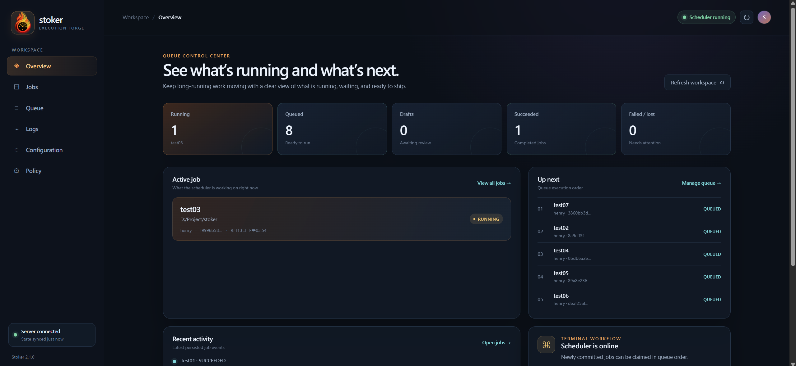

<h1 align="center">
  
</h1>
<br>

[](https://www.rust-lang.org/)

[](https://github.com/qinodes/stoker/actions/workflows/ci.yml)
[](https://codecov.io/gh/qinodes/stoker)
[](https://crates.io/crates/stoker-engine)
[](https://crates.io/crates/stoker-engine)
[](https://github.com/qinodes/stoker/blob/main/LICENSE)

[English](README.md) | [繁體中文](README.zh-TW.md) | 日本語

**stoker は Rust で作られた、軽量でクロスプラットフォーム対応のタスクスケジューリング CLI です。** serial mode と scheduled mode の 2 つの運用モードを提供します。

serial mode は、**GPU、CPU、メモリを大量に使う** Job を 1 件ずつ実行する用途に向いています。

scheduled mode は、**定期的に実行する**軽量な複数 step の task や、依存関係のある task に向いており、1 つの Flow で複数 task を実行できます。

Job の状態と log はローカルに保存されるため、外部データベースは必要ありません。

<p align="center">
  
</p>

## インストール

推奨インストーラーは最新 release をダウンロードし、SHA256 を検証して現在のユーザーにインストールし、ユーザーの `PATH` を更新します。管理者権限は必要ありません。

**Windows PowerShell**

```powershell
irm https://github.com/qinodes/stoker/releases/latest/download/stoker-install.ps1 | iex
```

**Linux / macOS**

```bash
curl --proto '=https' --tlsv1.2 -LsSf https://github.com/qinodes/stoker/releases/latest/download/stoker-install.sh | sh
```

Cargo を使う場合:

```bash
cargo install stoker-engine
```

手動インストールや特定バージョンは [GitHub Releases](https://github.com/qinodes/stoker/releases) を参照してください。

## 1. serial mode

**serial mode** は、各 Job を queue の順番で 1 回だけ実行する用途です。`stoker add` は command を実行したいディレクトリで実行してください。

基本形式:

```text
stoker add --user <USER> --name <NAME> --cmd "<COMMAND>"
stoker show <JOB_ID>
stoker commit <JOB_ID>
```

```bash
# serial mode に切り替えます。
stoker queue lock
stoker mode set serial
stoker queue unlock

# 共有マシンで一度だけ background scheduler を起動します。
stoker start

# DRAFT Job を作成します。command は後で現在のディレクトリから実行されます。
stoker add --user alice --name exp-a --cmd "python train.py --lr 0.0001"

# <JOB_ID> は前のコマンドに表示された Job UUID です。確認して queue に追加します。
stoker show <JOB_ID>
stoker commit <JOB_ID>

# queue と Job の出力を確認します。
stoker jobs
stoker logs -f <JOB_ID>
```

commit 後、Job は 1 件ずつ実行されます。`--user` は表示と絞り込みに使う owner ラベルであり、OS アカウントや認証ではありません。

queue の並べ替え、cancel、log、policy、timezone、backup、全コマンドは [繁體中文の serial ガイド](docs/serial.zh-TW.md) を参照してください。

## 2. scheduled mode

繰り返し実行する仕事や、依存関係を持つ複数 task には **scheduled mode** を使います。task と schedule を設定してから Flow を commit します。

基本形式:

```bash
# --once-at、--daily、--every のいずれか 1 つが必要です。
# --schedule-timezone は任意で、--daily と一緒にだけ使えます。
# --first-at は任意で、--every と一緒にだけ使えます。
stoker flow create <FLOW_ID> --user <USER> --name <NAME> (--once-at <RFC3339> | --daily <HH:mm> [--schedule-timezone <IANA_ZONE>] | --every <Nm|Nh> [--first-at <RFC3339>])
stoker flow task add <FLOW_ID> <TASK_ID> --name <NAME> --cmd "<COMMAND>"
stoker flow commit <FLOW_ID>
```

```bash
# scheduled mode に切り替えます。
stoker queue lock
stoker mode set scheduled
stoker queue unlock

stoker start

# DRAFT Flow を作成します。
# frequent_a001 が <FLOW_ID> です。後続の flow コマンドでも使います。
# --every 15m は 15 分ごとの実行、--first-at は最初の実行時刻を指定します。
stoker flow create frequent_a001 --user alice --name frequent --every 15m --first-at 2099-01-01T10:00:00+09:00

# one-time または daily schedule も選べます。
# stoker flow create my_task_once --user alice --name once --once-at 2099-01-01T10:00:00+09:00
# stoker flow create my_task_nightly --user alice --name nightly --daily 23:30 --schedule-timezone Asia/Tokyo

# task を実行するディレクトリに移動してから、frequent_a001 に task を追加します。
# refresh と publish が <TASK_ID> です。--after refresh は最初の task の ID を指定します。
stoker flow task add frequent_a001 refresh --name refresh --cmd "python refresh_cache.py"
stoker flow task add frequent_a001 publish --name publish --cmd "python publish_summary.py" --after refresh

# 検証して Flow を有効化します。
stoker flow commit frequent_a001
stoker flow list
```

one-time / periodic schedule、standalone scheduled Job、retry、Flow 編集、run の確認、cancel、recovery は [繁體中文の scheduled ガイド](docs/scheduled.zh-TW.md) を参照してください。
