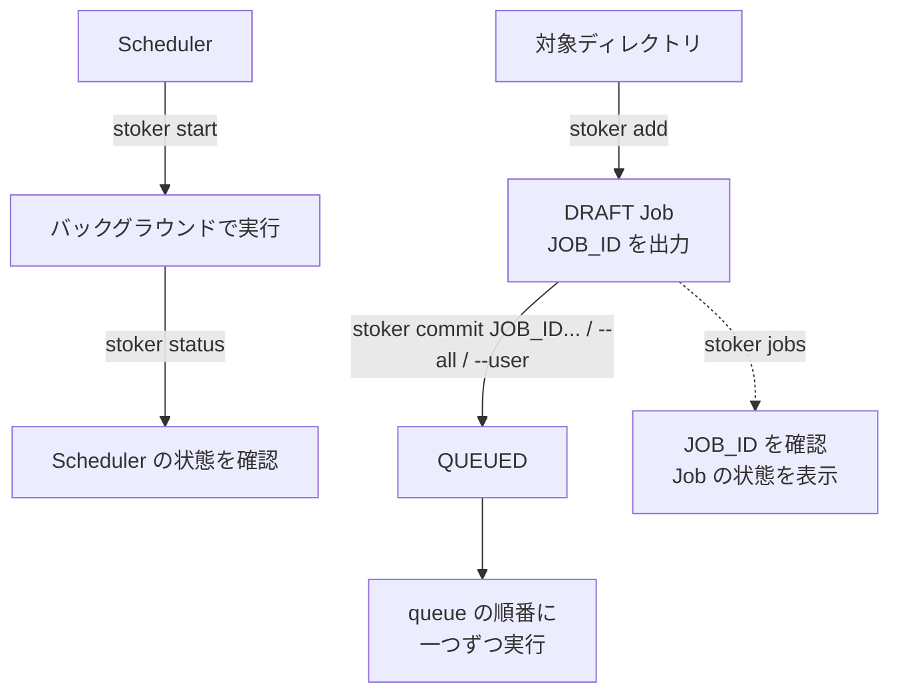

<h1 align="center">
  
</h1>
<br>

[](https://www.rust-lang.org/)

[](https://github.com/qinodes/stoker/actions/workflows/ci.yml)
[](https://codecov.io/gh/qinodes/stoker)
[](https://crates.io/crates/stoker-engine)
[](https://crates.io/crates/stoker-engine)
[](https://github.com/qinodes/stoker/blob/main/LICENSE)

[English](README.md) | [繁體中文](README.zh-TW.md) | 日本語

**stoker は、複数人で同じマシンを共有し、時間のかかるジョブを順番に実行するためのクロスプラットフォーム（Linux／macOS／Windows）CLI です。**

バッチ計算やデータ処理でリソースを長時間使うとき、Stoker なら各自のジョブを共通のキューに登録できます。バックグラウンドのスケジューラーが一度に一つずつ実行するため、キュー内のジョブ同士による GPU、CPU、メモリの競合を減らせます。

同僚に「今使ってる？ もう使っていい？」と聞く必要はありません。キューに登録しておけば、自分の番になったら自動で実行されます。

- **複数人で登録、一つのキューで管理：** 複数のユーザーが同時にジョブを登録でき、CLI や Web UI で状態の確認やキューの並べ替えができます。

- **準備してから、キューに追加：** `stoker add` で下書きの Job を作成し、確認後に `stoker commit` で実行キューに追加します。

- **作業ディレクトリを保持：** 各 Job はデフォルトで `stoker add` を実行したディレクトリから起動するため、異なるプロジェクトのジョブも手軽に登録できます。

- **軽量な常駐動作：** Rust で開発され、低リソース消費を目指して設計されています。バックグラウンドでの長時間のキュー管理に適しており、計算リソースを実行するジョブに回せます。

Job の状態はローカルの SQLite に保存し、実行ログもローカルに保持します。Redis、PostgreSQL などの外部データベースサービスを別途用意する必要はありません。

## Web UI デモ

<p align="center">
  
</p>

Web UI では、DRAFT Job の作成と確認、説明の編集、Job の commit／cancel、Queue の管理、ログの表示、タイムゾーン・設定スナップショット・scheduler policy の管理ができます。

```bash
stoker start
stoker ui start --open
```

アドレスの確認には `stoker ui status`、UI server の停止には `stoker ui stop` を使用します。デフォルトでは `127.0.0.1:8765` のみで待ち受けます。

ローカルネットワークからアクセスできるようにする場合は、loopback 以外のアドレスを明示的に指定します。

```bash
stoker ui start --host 0.0.0.0 --port 8765
```

LAN モードでは追加の token 認証を行いません。信頼できるネットワークでのみ loopback 以外のアドレスにバインドしてください。

## インストール

### ワンラインインストーラー（推奨）

インストーラーは最新 release をダウンロードして SHA256 を検証し、Stoker を現在のユーザー用ディレクトリにインストールして、ユーザーの `PATH` に永続的に追加します。管理者権限は必要ありません。

**Windows PowerShell:**

```powershell
irm https://github.com/qinodes/stoker/releases/latest/download/stoker-install.ps1 | iex
```

`%LOCALAPPDATA%\Programs\stoker` にインストールされます。

**Linux／macOS:**

```bash
curl --proto '=https' --tlsv1.2 -LsSf https://github.com/qinodes/stoker/releases/latest/download/stoker-install.sh | sh
```

`~/.local/bin` にインストールされます。現在の release は Linux x86_64 と macOS Apple Silicon に対応しています。

特定の公開バージョンをインストールする場合は、URL の `latest` を release tag に置き換えます。

```powershell
irm https://github.com/qinodes/stoker/releases/download/v1.2.3/stoker-install.ps1 | iex
```

```bash
curl --proto '=https' --tlsv1.2 -LsSf https://github.com/qinodes/stoker/releases/download/v1.2.3/stoker-install.sh | sh
```

### 手動インストール

[GitHub Releases](https://github.com/qinodes/stoker/releases) から環境に合うアーカイブをダウンロードし、`stoker` 実行ファイルを展開して、そのディレクトリを `PATH` に追加してください。

- Windows: `stoker-windows-x86_64.zip`
- Linux: `stoker-linux-x86_64.tar.gz`
- macOS Apple Silicon: `stoker-macos-arm64.tar.gz`

ダウンロードした実行ファイルは環境変数に自動で追加されません。実行ファイルのあるディレクトリを `PATH` に追加してください。

**Windows:** 「環境変数」の「ユーザー環境変数」で `Path` を編集し、実行ファイルのあるディレクトリを追加してから、ターミナルを再起動します。

**macOS／Linux:** `/path/to/stoker` を実行ファイルのある実際のディレクトリに置き換え、次の内容を `~/.zshrc`（macOS）または `~/.bashrc`（Linux）に追加してから、ターミナルを再起動します。

```bash
export PATH="/path/to/stoker:$PATH"
```

書き込んだ後、現在のターミナルにすぐ反映する場合は、次を実行します。

```bash
source ~/.bashrc  # Linux
source ~/.zshrc   # macOS
```

各 release には、プラットフォーム用の実行ファイルと `SHA256SUMS` も含まれます。

### Cargo がインストール済みの場合

```bash
cargo install stoker-engine
```

## クイックスタート

### 基本的な流れ

```bash
# scheduler をバックグラウンドで起動
stoker start

# scheduler の状態を確認
stoker status

# タスクの実行に必要なルートディレクトリで DRAFT Job を作成
# stoker add は JOB_ID を出力します
stoker add --user alice --name exp-a --cmd "python train.py --lr 0.0001"

# stoker add が出力した JOB_ID を使って Job を queue に追加
# JOB_ID は stoker jobs でも確認できます
stoker commit <JOB_ID>

# または、すべての DRAFT Job を作成時間順に queue へ追加
stoker commit --all

# または、指定した論理ユーザーのすべての DRAFT Job を queue へ追加
stoker commit --user alice

# すべての Job と現在の状態を一覧表示
stoker jobs
```



`--user` は stoker の論理的な owner ラベルであり、OS アカウントや認証機能ではありません。

### コマンドリファレンス

```bash

# scheduler をバックグラウンドで起動（Linux、macOS、Windows）
stoker start

# 対象ディレクトリで DRAFT Job を作成
stoker add --user <任意のユーザー名> --name <Job 名> --cmd "<実行するコマンド>"
# 例:
# stoker add --user alice --name exp-a --cmd "python train.py --lr 0.0001"

# 内容を確認して queue に追加（<JOB_ID> は直前の出力を使用）
# Job の詳細を表示
stoker show <JOB_ID>
# Job を送信（DRAFT -> QUEUED）
stoker commit <JOB_ID>
# 複数の Job を指定した順番で queue に追加
stoker commit <JOB_ID_1> <JOB_ID_2>
# すべての DRAFT Job を作成時間順に queue へ追加
stoker commit --all
# 指定した論理ユーザーの DRAFT Job を作成時間順に queue へ追加
stoker commit --user <ユーザー名>

# queued Job の順序を変更する前にロックし、完了後に明示的に解除
stoker queue lock
stoker queue edit
stoker status
stoker queue unlock

# 確認と管理

# scheduler の状態を確認
stoker status

# すべての Job の状態を表示
stoker jobs

# Job を絞り込み
stoker jobs --user alice
stoker jobs --state draft
stoker jobs --state queued
# 絞り込み条件を組み合わせる
stoker jobs --user alice --state failed

# SUCCEEDED、FAILED、CANCELLED、LOST の Job とログを削除
# scheduler 実行中でも使用できます。
stoker clean

# 現在あるログを表示して終了
stoker logs <JOB_ID>

# 新しいログを Job の終了まで表示（Ctrl+C でも停止できます）
stoker logs -f <JOB_ID>

# Job をキャンセル（DRAFT、QUEUED、STARTING、RUNNING、CANCELLING）
stoker cancel <JOB_ID>
# スクリプトでは --yes を付けて確認プロンプトを省略できます。

# scheduler を停止
# 実行中の Job がある場合、強制キャンセル前に確認します。
# QUEUED の Job は次回の scheduler 起動時まで保持されます。
stoker stop
# スクリプトでは --yes を付けて確認プロンプトを省略できます。

# 現在のバージョンを表示
stoker --version

# 最新版に更新
# 更新前に scheduler を停止してください。
stoker update
# スクリプトでは --yes を付けて確認プロンプトを省略できます。

# アンインストール
# アンインストール前に scheduler を停止してください。
# Job データとログは Stoker のデータフォルダーに保持されます
# （macOS/Linux: ~/.stoker、Windows: %USERPROFILE%\.stoker）。
stoker uninstall
# スクリプトでは --yes を付けて確認プロンプトを省略できます。
```

`--cmd` の後ろの完全なコマンドは、引用符で囲む必要があります。

Job は対話型 terminal のないバックグラウンドで実行されます。対話なしで実行できるコマンドとオプションを使用してください。

コマンドはプラットフォームの shell（Linux／macOS は `sh`、Windows は
`cmd.exe`）で実行されるため、shell 構文や利用できるプログラムはプラットフォーム
によって異なる場合があります。

## Docker で Job を実行する場合

Job を Docker container で実行し、Stoker に container の終了を待ってから次の Job を実行させるには、foreground モードを使用します。

```bash
docker run <IMAGE> <COMMAND>
```

この場合は `docker run -d` を使用しないでください。detach モードでは container の起動直後にコマンドが終了するため、Stoker は完了したと判断し、次の queued Job を開始する場合があります。

## Job の状態とキャンセル

| 状態 | 説明 |
| --- | --- |
| `DRAFT` | add 済みですが、まだ commit されていません。 |
| `QUEUED` | commit 済みで、実行待ちです。 |
| `STARTING` | scheduler が Job を取得し、ソースディレクトリとプロセスを準備しています。 |
| `RUNNING` | Job のプロセスが実行中です。 |
| `CANCELLING` | キャンセルが要求され、stoker がプロセスの停止とクリーンアップを行っています。 |
| `SUCCEEDED` | Job が正常に完了しました。 |
| `FAILED` | Job のプロセスが失敗したか、stoker が実行フローを完了できませんでした。 |
| `CANCELLED` | Job はキャンセルされました。 |
| `LOST` | scheduler の再起動時に、実行中だった Job の管理状態が失われました。 |

## Queue のロックとエディター

`stoker status` で queue の状態を確認できます。

編集前に `stoker queue lock`、編集後に `stoker queue unlock` を実行します。

ロック中は `stoker commit`、`stoker commit --all`、`stoker commit --user` は使えませんが、`cancel` と `add` は使用できます。

`stoker queue edit` はロック中のみ使用できます。

エディターには実行順の `QUEUED` Job だけが表示されます。

| モード | キー | 操作 |
| --- | --- | --- |
| Browse | `↑` / `↓` | Job を選択します。 |
| Browse | `Enter` | 選択した Job の移動モードに入ります。 |
| Browse | `q` / `Esc` | queue をロックしたままエディターを終了します。 |
| Move | `↑` / `↓` | 選択した Job の位置を調整します。 |
| Move | `Enter` | 移動を確定して Browse モードに戻ります。 |
| Move | `q` / `Esc` | 現在の移動だけを元に戻して Browse モードに戻ります。 |

## タイムゾーン設定

SQLite 内の時刻は常に UTC で保存されます。`stoker jobs` と `stoker show` では、表示時だけ設定されたタイムゾーンへ変換し、RFC3339 の offset も保持します。

Stoker のデータフォルダーを初めて初期化すると、OS の IANA タイムゾーンを検出して次のファイルに保存します。

```text
~/.stoker/config.json
```

設定例：

```json
{
  "timezone": "Asia/Taipei"
}
```

タイムゾーンの設定、確認、解除：

```bash
stoker config show
stoker config set timezone Asia/Taipei
stoker config get timezone
stoker config unset timezone
```

`stoker config show` は config ファイルの場所とタイムゾーン設定だけを表示します。

タイムゾーンの値を省略すると、対話型の選択画面が開きます。

```bash
stoker config set timezone
```

Stoker が `config.json` を作成または更新すると、タイムスタンプ付きの snapshot を次の場所に保存します。

```text
~/.stoker/snapshot/
```

リスクのある変更を行う前に手動で snapshot を作成するには、次を実行します。

```bash
stoker config snapshot
```

設定内容が変わっていない場合でも、このコマンドは新しい snapshot を作成します。

対話型の復元画面で snapshot を選択できます。

```bash
# 最新の snapshot が一番上に表示されます。矢印キーで選択し、`Enter` で読み取り専用の詳細を表示し、`Esc` または `q` で一覧に戻り、`Enter` の後に `y` を押して復元を確認します。
# 復元前に現在の設定が新しい snapshot として保存されます。
stoker config restore
```

1 回の表示コマンドだけ設定を上書きする場合は、`--timezone` または短い `--tz` を使用します。

```bash
stoker jobs --tz Asia/Tokyo
stoker show <JOB_ID> --timezone UTC
```

適用順序は CLI オプション、`config.json`、OS のタイムゾーンです。

## ログ容量と実行ポリシー

ログには安全な既定値があり、最新の末尾だけを保持します。

| 設定 | 既定値 | 用途 |
| --- | ---: | --- |
| `log-max-bytes-per-job`（stdout + stderr） | 64 MB | 1 Job で共有するログ上限。超過すると古い分割ログを破棄します。 |
| `log-segment-bytes` | 1 MB | ローテーションする各ログ分割のサイズ。 |
| `log-max-bytes-total`（terminal Job） | 1024 MB | 終了済み Job のログアーティファクト全体の上限。 |
| `log-retention-jobs` | 100 | ログを保持する新しい terminal Job の数。 |
| `log-disk-reserve-bytes` | 512 MB | 最低空き容量。この値を下回ると scheduler は新しい queued Job を開始しません。 |
| `termination-grace-ms` | 500 | キャンセル後、強制終了に移るまで正常終了を待つ時間。 |
| `startup-timeout-ms` | 30,000 | run directory、ログ、作業ディレクトリの準備に許される最長時間。 |
| `max-runtime-ms` | 無効 | Job の最大実行時間。無効の場合は自動タイムアウトしません。 |

変更には queue のロックと、`STARTING`、`RUNNING`、`CANCELLING` Job が存在しないことが必要です。queued Job は残せます。

ログ容量は単位を付けず、MB の整数で入力します（例: `256`）。

```bash
stoker queue lock
stoker policy set log-max-bytes-per-job 256
stoker policy set log-retention-jobs 30
stoker policy set termination-grace-ms 30000
stoker policy set max-runtime-ms 43200000
stoker policy unset max-runtime-ms
stoker queue unlock
```

`stoker policy show` または `stoker policy get <KEY>` でポリシーの値を確認できます。容量超過やログ書き込みエラーが発生しても子プロセスの出力は読み続けます。古い分割ログが破棄された場合、CLI はログが切り詰められたことを表示します。空き容量が reserve を下回ると、scheduler は次の queued Job を開始せず、`stoker status` に警告を表示します。

## Flow と scheduled Job

Flow は複数の task を 1 回の実行にまとめ、上流 task の成功または失敗を依存条件として宣言できます。

### 正式な Flow コマンドインターフェース

以下は現在ユーザー向けに提供している完全な Flow コマンドツリーです。`FLOW_ID` と `TASK_ID` は位置引数です。実行記録を選択する `RUN_ID`、task、attempt は常に option で指定します。

~~~text
stoker flow create <FLOW_ID> --user <USER> --name <NAME> --at <RFC3339>
stoker flow create <FLOW_ID> --user <USER> --name <NAME> --daily <HH:mm> [--schedule-timezone <ZONE>]
stoker flow commit <FLOW_ID>
stoker flow list [--user <USER>]
stoker flow show <FLOW_ID> [--run <RUN_ID> [--task <TASK_ID>]]
stoker flow runs <FLOW_ID>
stoker flow occurrences <FLOW_ID>

stoker flow run <FLOW_ID> [--replace-next] [--request-id <UUID>]
stoker flow logs <FLOW_ID> --run <RUN_ID> --task <TASK_ID> [--attempt <N>] [--follow]
stoker flow cancel <FLOW_ID> --run <RUN_ID> [--task <TASK_ID>]

stoker flow task add <FLOW_ID> <TASK_ID> --name <NAME> --cmd <COMMAND>
    [--after <TASK_ID>]... [--after-failure <TASK_ID>]...
    [--match all|any] [--retries <N>] [--revision <N>]

stoker flow task update <FLOW_ID> <TASK_ID>
    [--cmd <COMMAND>] [--cwd <DIR>] [--retries <N>]
    [--after <TASK_ID>]... [--after-failure <TASK_ID>]...
    [--match all|any] [--clear-dependencies] [--revision <N>]

stoker flow task remove <FLOW_ID> <TASK_ID>
    [--scope future|current|both] [--run <RUN_ID>] [--revision <N>]

stoker flow schedule set <FLOW_ID> --at <RFC3339> [--revision <N>]
stoker flow schedule set <FLOW_ID> --daily <HH:mm> [--schedule-timezone <ZONE>] [--revision <N>]
stoker flow schedule set <FLOW_ID> --schedule-timezone <ZONE> [--revision <N>]

stoker flow edit begin <FLOW_ID>
stoker flow edit apply <FLOW_ID> [--revision <N>]
stoker flow edit discard <FLOW_ID> --revision <N>

stoker flow disable <FLOW_ID>
stoker flow enable <FLOW_ID>
~~~

重要な option の規則：

- `--after TASK_ID` は上流 task の成功を条件にし、`--after-failure TASK_ID` は上流 task の失敗を条件にします。どちらも複数回指定できます。
- `--match all|any` は、複数の dependency のすべてを満たす必要があるか、いずれか 1 つでよいかを指定します。
- `--retries N` は失敗後に許可する retry 回数です。`0` は retry しません。
- `--revision N` は draft の compare-and-swap revision です。revision が一致しない場合、変更は適用されません。
- `--attempt N` は `1` から始まります。省略すると、`flow logs` はその task のすべての attempt を表示します。
- `--cmd` はプラットフォームの shell に渡す 1 つの command string を受け取ります。空白や shell operator を含む場合は引用符で囲んでください。
- `flow edit discard` は draft だけを破棄し、Flow は frozen のままです。freeze を解除するには、その後に `flow edit apply` を実行してください。
- Flow は `scheduled` mode にのみ存在します。mode を切り替える前に queue を手動で lock してください。`mode set` は自動的に lock または unlock せず、成功後も queue は locked のままです。

~~~bash
# scheduled definition を作成する前に workspace mode を変更
stoker queue lock
stoker mode set scheduled
stoker queue unlock

# scheduled flow を作成
stoker flow create nightly --user alice --name nightly --daily 23:30 --schedule-timezone Asia/Tokyo

# task を実行するディレクトリから task を追加
stoker flow task add nightly prepare --name prepare --cmd "python prepare.py"
stoker flow task add nightly train --name train --cmd "python train.py" --after prepare
stoker flow commit nightly

~~~

### Flow CLI 完全リファレンス

次の表では `nightly` を `FLOW_ID`、`prepare`／`train` を `TASK_ID` として使用します。`RUN_UUID`、`REQUEST_UUID`、`OCCURRENCE_UUID` は Stoker が出力する UUID です。実際の値に置き換えてください。

| 用途 | コマンド | 動作と重要な option | 成功時の出力例 |
|---|---|---|---|
| mode を表示 | `stoker mode show` | 現在の workspace が `serial` または `scheduled` mode のどちらかを表示します。 | `scheduled` |
| mode を切り替え | `stoker queue lock`<br>`stoker mode set serial` または `stoker mode set scheduled`<br>`stoker queue unlock` | 先に queue を手動で lock する必要があります。execution が開始中、実行中、キャンセル中、クリーンアップ中、または recovery 中の場合は切り替えを拒否します。`mode set` は自動的に lock／unlock しません。成功後も queue は locked のため、確認してから解除してください。 | `Mode set to scheduled; queue remains locked.` |
| Flow を作成 | `stoker flow create nightly --user alice --name nightly --at 2026-09-20T10:00:00+09:00`<br>`stoker flow create nightly --user alice --name nightly --daily 23:30 --schedule-timezone Asia/Tokyo` | Flow は `scheduled` mode でのみ使用できます。`--at RFC3339` または `--daily HH:mm` のどちらかを指定してください。daily timezone には IANA 名を使用します。`--schedule-timezone` を省略すると、設定ファイルの timezone、次にシステムのローカル timezone を使用します。システム timezone を判定できない場合は明示的な指定が必要です。serial ですぐに実行する場合は standalone の `stoker add` を使用してください。 | `Created flow nightly (DRAFT, draft revision 0).` |
| task を追加 | `stoker flow task add nightly prepare --name prepare --cmd "python prepare.py"` | 現在のディレクトリを作業ディレクトリとする task を追加します。`--retries N`、複数の `--after TASK_ID`／`--after-failure TASK_ID`、`--match all\|any`、`--revision N` を指定できます。 | `Added task to flow nightly (draft revision 0).` |
| Flow を commit | `stoker flow commit nightly` | 完全な task graph を検証して draft を commit します。scheduler が実行できるのは commit 後です。 | `Committed flow nightly (2 task(s)).` |
| Flow を一覧表示 | `stoker flow list [--user alice]` | Flow ごとに schedule、status、active run、次回の trigger 時刻を含む 1 行の整列済み概要を表示します。task は展開しません。 | `FLOW_ID  NAME  USER  SCHEDULE  STATUS  ACTIVE  NEXT` |
| definition を表示 | `stoker flow show nightly` | Flow definition、status、schedule、revision、task ID、dependency を JSON-like 形式で表示します。 | `"flow_id": "nightly"`<br>`"committed": true`<br>`"task_id": "train"` |
| 手動実行 | `stoker flow run nightly [--replace-next] [--request-id REQUEST_UUID]` | manual run を作成します。`--replace-next` は、この実行の開始後に次の scheduled occurrence を置き換えます。同じ `--request-id` を再送すると同じ結果を取得します。 | `Created flow run RUN_UUID for nightly (request-id REQUEST_UUID).` |
| run を一覧表示 | `stoker flow runs nightly` | すべての実行記録を整列した列で表示します。`RUN_ID` 列が後続コマンドで使用する `RUN_UUID` です。 | 完全な出力は下記を参照してください。 |
| run を表示 | `stoker flow show nightly --run RUN_UUID` | 1 回の run の source、全体の state、各 task の state と attempt 数を JSON-like 形式で表示します。 | `"run_id": "RUN_UUID"`<br>`"source": "MANUAL"`<br>`"state": "SUCCEEDED"` |
| occurrence を一覧表示 | `stoker flow occurrences nightly` | 自動 schedule の occurrence、UTC の due time、state、reason を整列した列で表示します。 | 完全な出力は下記を参照してください。 |
| task run を表示 | `stoker flow show nightly --run RUN_UUID --task prepare` | 指定した run の JSON-like 出力を 1 つの task に絞り込み、state と attempt 数を表示します。 | `"task_id": "prepare"`<br>`"state": "SUCCEEDED"`<br>`"attempts": 1` |
| task log を表示 | `stoker flow logs nightly --run RUN_UUID --task prepare [--attempt N] [-f]` | stdout/stderr を表示します。`--attempt` を省略するとすべての attempt を表示し、`-f`／`--follow` は task が終了するまで出力を追跡します。 | `--- .../attempt-1/stdout.log ---`<br>`task output` |
| Flow run をキャンセル | `stoker flow cancel nightly --run RUN_UUID` | 指定した run と未完了 task のキャンセル要求を記録します。括弧内はコマンド完了時に読み戻した run state です。プロセスのクリーンアップは非同期のため、まだ `Running`、すでに `Cancelling`、または `Cancelled` の場合があります。 | `Cancelled flow run RUN_UUID (STATE).` |
| task をキャンセル | `stoker flow cancel nightly --run RUN_UUID --task prepare` | 指定した run の task だけをキャンセルします。括弧内は同様にコマンド完了時に読み戻した run state で、実行中のプロセスはバックグラウンドで停止およびクリーンアップされます。 | `Cancelled task prepare in run RUN_UUID (STATE).` |
| 編集を開始 | `stoker flow edit begin nightly` | commit 済み Flow を freeze し、新しい run、task、retry の intake を一時停止します。future draft は最初の future-scope 変更時に作成されます。実行中のプロセスは継続します。 | `Flow 'nightly' is frozen for editing.` |
| task を更新 | `stoker flow task update nightly train [--cmd CMD] [--cwd DIR] [--retries N] [--after TASK] [--after-failure TASK] [--match all\|any] [--clear-dependencies] [--revision N]` | future draft を更新します。少なくとも 1 つの項目が必要で、dependency option は複数回指定できます。 | `Updated task train in flow nightly (draft revision 1).` |
| task を削除 | `stoker flow task remove nightly train [--scope future\|current\|both] [--run RUN_UUID] [--revision N]` | 既定の scope は `future` です。`current`／`both` は指定した active run に適用され、`--run` が必要です。Flow は frozen でなければなりません。 | `Draft revision 2 for flow nightly.` |
| schedule を変更 | `stoker flow schedule set nightly --at 2026-09-20T10:00:00+09:00`<br>`stoker flow schedule set nightly --daily 23:30 --schedule-timezone Asia/Tokyo`<br>`stoker flow schedule set nightly --schedule-timezone UTC` | frozen Flow の future schedule を変更し、`--revision N` を指定できます。既存の once Flow は別の future once 時刻にのみ変更でき、daily Flow は daily 時刻または timezone のみ変更できます。once と daily は相互に変更できません。timezone だけの変更は daily Flow にのみ使用できます。non-pending occurrence がある terminal once Flow は再度 schedule できないため、新しい Flow を作成してください。 | `Updated flow nightly draft revision 2.` |
| draft を破棄 | `stoker flow edit discard nightly --revision N` | 未適用の future 変更を破棄します。Flow は frozen のままです。 | `Discarded draft for nightly (still frozen=true).` |
| 編集を適用 | `stoker flow edit apply nightly [--revision N]` | future draft がある場合は、検証して適用し、graph revision を増やして Flow の freeze を解除します。current-scope の操作だけを行い future draft がない場合は、`--revision` を省略して直接 freeze を解除します。このコマンドはグローバル queue lock を解除しません。 | `Applied edits to nightly (graph revision 2).` |
| 自動 trigger を無効化 | `stoker flow disable nightly` | 今後の automatic trigger を停止します。有効な manual run は引き続き実行できます。 | `Disabled nightly.` |
| 自動 trigger を有効化 | `stoker flow enable nightly` | 今後の automatic trigger を再開します。 | `Enabled nightly.` |
| 冪等 request を照会 | `stoker request show REQUEST_UUID` | manual run の request ID から、対応する Flow、run UUID、result を照会します。 | `request_id=REQUEST_UUID flow_id=nightly run_id=RUN_UUID result=CREATED` |
| recovery を reconcile | `stoker recovery reconcile RUN_UUID --confirm-stopped` | 再起動によって run が `Recovering` になり、そのプロセスが停止したことを手動で確認済みの場合にのみ使用します。すべての recovery を解決してから queue を unlock してください。 | `Reconciled recovery for RUN_UUID; queue may be unlocked after all recoveries are resolved.` |

`flow runs` は実際の内容から列幅を計算して整列します。

```text
RUN_ID                                FLOW_ID  STATE     SOURCE
------------------------------------  -------  --------  ------
2238b174-1480-48c0-b1b7-e8ce36bca1b7  nightly  Starting  MANUAL
```

`flow occurrences` も同じ整列形式を使用し、`DUE_AT_UTC` は常に UTC で表示します。

```text
OCCURRENCE_ID                         FLOW_ID  STATE    DUE_AT_UTC                 REASON
------------------------------------  -------  -------  -------------------------  ------
6560cda6-92a3-4429-955a-16aa3a1c3618  nightly  Pending  2099-01-01T00:00:00+00:00
```

Flow コマンドは常に `stoker flow` で始まります。トップレベルの scheduled-job コマンドは standalone Job の UUID だけを受け取ります。完全な引数は `stoker flow --help`、`stoker flow task --help`、各サブコマンドの `--help` で確認できます。

One-time schedule は秒と明示的な UTC offset を含む RFC 3339 を使用します。例：
`2026-09-15T23:30:00+09:00`。Daily schedule は `HH:mm` と IANA timezone を使用します。
実行時刻を過ぎた daily occurrence は再実行しません。DST に存在しない時刻はスキップし、
重複する時刻では早い方の instant を使用します。

commit 済み Flow を変更するには、編集を開始して future draft を変更し、最後に適用します。
draft revision を compare-and-swap に使用できます。

~~~bash
stoker flow edit begin nightly
stoker flow task update nightly train --retries 2 --revision 0
stoker flow edit apply nightly --revision 1
~~~

再起動後に run が `RECOVERING` のままの場合は、process が停止したことを確認してから
reconcile を実行し、最後に queue lock を解除します。

~~~bash
stoker recovery reconcile <RUN_ID> --confirm-stopped
stoker queue unlock
~~~

## SQLite の検査と復元

```bash
stoker db check
stoker db check --integrity
stoker db backup
stoker db backup <BACKUP_PATH>
```

保存先を指定しない場合、`stoker db backup` はタイムスタンプ付きバックアップを `<STOKER_HOME>/backups/`（通常は `~/.stoker/backups/`）に作成し、実際のパスを表示します。保存先を指定した場合はそのパスに作成します。`backup` は SQLite の WAL 内容も含みます。復元前に scheduler を停止してバックアップを確認してください。

```bash
stoker db restore <BACKUP_PATH> --yes
```

`restore` は `--yes` による明示確認が必要です。scheduler が中断すると実行中 Job は `LOST` になり queue がロックされます。Workload を確認・処理した後に `stoker queue unlock` を実行してください。自動 retry や外部副作用の exactly-once は保証しません。

## 補足説明

ソースディレクトリのファイルに対して command が行った変更は保持されます。stoker はそのディレクトリ内のファイルを自動で変更または復元しません。

特定のバージョンをインストールする場合：

`cargo install stoker-engine --version <VERSION> --force`。

ログは `.stoker/runs/<JOB_ID>/stdout.log` と `.stoker/runs/<JOB_ID>/stderr.log` に保存されます。

## 対象範囲と制限

- 単一マシンの queue のみ対応。複数マシン、リモート実行、分散学習、GPU 割り当て、コンテナのスケジューリングには対応しません。
- add 時の作業ディレクトリが存在し、ディレクトリである必要があります。中のファイルは検査しません。
- Python/Conda/CUDA 環境、データセット、checkpoint、artifact、実験メトリクスは管理しません。
- stoker のアカウント、ログイン、権限管理はありません。`--user` は識別と絞り込み専用です。
