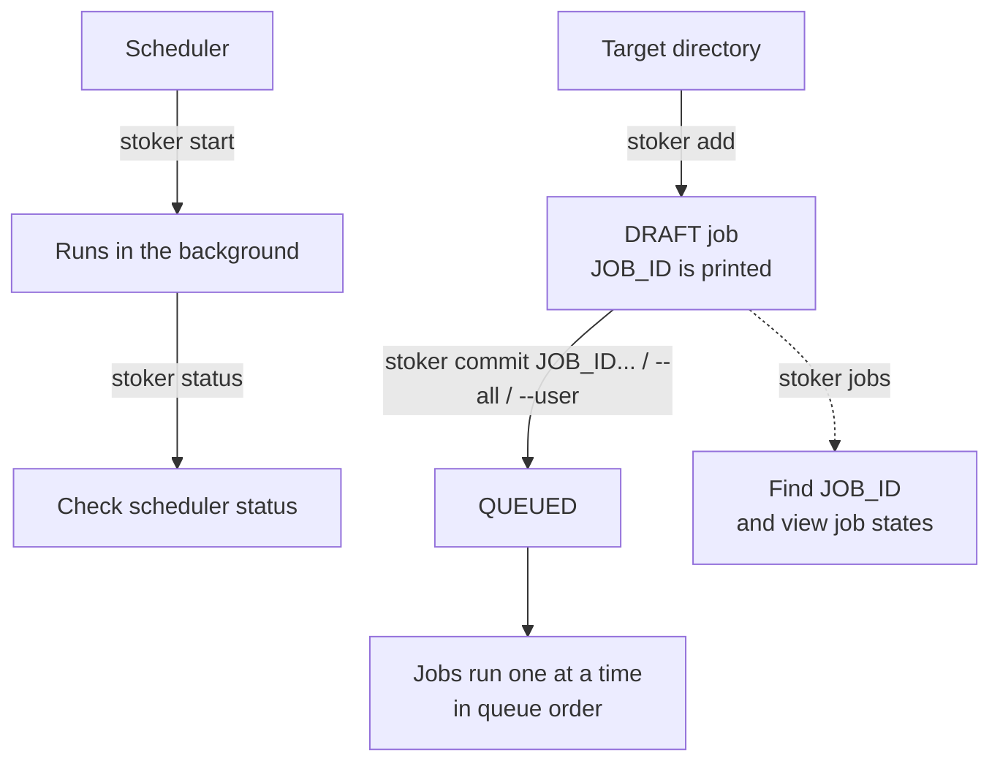

<h1 align="center">
  
</h1>
<br>

[](https://www.rust-lang.org/)

[](https://github.com/qinodes/stoker/actions/workflows/ci.yml)
[](https://codecov.io/gh/qinodes/stoker)
[](https://crates.io/crates/stoker-engine)
[](https://crates.io/crates/stoker-engine)
[](https://github.com/qinodes/stoker/blob/main/LICENSE)

[繁體中文](README.zh-TW.md) | [日本語](README.ja.md) | English

**stoker is a cross-platform (Linux/macOS/Windows) CLI for sharing a machine and running time-consuming jobs one at a time.**

When batch computation or data processing ties up resources for long periods, Stoker lets everyone put their work in a shared queue. The background scheduler runs one job at a time, reducing competition for GPU, CPU, or memory among queued jobs.

No more asking a colleague, “Are you using it? Can I use it now?” Add your work to the queue, and it runs automatically when your turn comes.

- **Submit together, queue centrally:** Multiple users can submit jobs at the same time, view job status, and reorder the queue through the CLI or Web UI.

- **Prepare first, submit when ready:** `stoker add` creates a draft Job. Review it, then use `stoker commit` to add it to the execution queue.

- **Keep your working directory:** Each Job starts by default in the directory where you ran `stoker add`, making it easy to submit work from different projects.

- **Lightweight background operation:** Built with Rust and designed for low resource usage, Stoker is suited to managing the job queue in the background for long periods, leaving computing resources for your work.

Job state is stored in a local SQLite database, and execution logs are kept locally. No Redis, PostgreSQL, or other external database service needs to be set up.

## Web UI demo

<p align="center">
  
</p>

The Web UI can create and review DRAFT jobs, edit descriptions, commit or cancel jobs, manage the queue, read logs, manage timezone snapshots, and adjust scheduler policy.

```bash
stoker start
stoker ui start --open
```

Use `stoker ui status` to show the address and `stoker ui stop` to stop the UI server. By default it listens only on `127.0.0.1:8765`.

To allow access from the local network, bind an explicit non-loopback address:

```bash
stoker ui start --host 0.0.0.0 --port 8765
```

LAN mode does not require an additional token; bind a non-loopback address only on a network you trust.

## Installation

### One-line installer (recommended)

The installer downloads the latest release, verifies its SHA256 checksum,
installs Stoker for your user, and adds the install directory to your
permanent user `PATH`. No administrator privileges are required.

**Windows PowerShell:**

```powershell
irm https://github.com/qinodes/stoker/releases/latest/download/stoker-install.ps1 | iex
```

Installs to `%LOCALAPPDATA%\Programs\stoker`.

**Linux/macOS:**

```bash
curl --proto '=https' --tlsv1.2 -LsSf https://github.com/qinodes/stoker/releases/latest/download/stoker-install.sh | sh
```

Installs to `~/.local/bin`. The current releases support Linux x86_64 and
macOS Apple Silicon.

To install a specific published version, replace `latest` with its release tag:

```powershell
irm https://github.com/qinodes/stoker/releases/download/v1.2.3/stoker-install.ps1 | iex
```

```bash
curl --proto '=https' --tlsv1.2 -LsSf https://github.com/qinodes/stoker/releases/download/v1.2.3/stoker-install.sh | sh
```

### Manual installation

Download the archive for your platform from [GitHub Releases](https://github.com/qinodes/stoker/releases), extract the `stoker` executable, and add its directory to `PATH`:

- Windows: `stoker-windows-x86_64.zip`
- Linux: `stoker-linux-x86_64.tar.gz`
- macOS Apple Silicon: `stoker-macos-arm64.tar.gz`

Downloaded executables are not added to the environment automatically. Add the directory containing the executable to `PATH` permanently, then reopen the terminal.

**Windows:** Edit `Path` under User variables in Environment Variables and add the executable's directory.

**macOS/Linux:** Add the following to `~/.zshrc` (macOS) or `~/.bashrc` (Linux), replacing `/path/to/stoker` with the actual directory containing the executable:

```bash
export PATH="/path/to/stoker:$PATH"
```

To apply the setting immediately in the current terminal, run:

```bash
source ~/.bashrc  # Linux
source ~/.zshrc   # macOS
```

Each release also includes a platform binary and `SHA256SUMS`.

### With Cargo already installed

```bash
cargo install stoker-engine
```

## Quick start

### Basic workflow

```bash
# Start the scheduler in the background
stoker start

# Check the scheduler status
stoker status

# Create a DRAFT job from the root directory required for task execution
# stoker add prints the JOB_ID
stoker add --user alice --name exp-a --cmd "python train.py --lr 0.0001"

# Commit the JOB_ID printed by stoker add
# You can also find the JOB_ID with `stoker jobs`
stoker commit <JOB_ID>

# Or commit all DRAFT jobs in creation order
stoker commit --all

# Or commit all DRAFT jobs belonging to one logical user
stoker commit --user alice

# List all jobs and their current states
stoker jobs
```



`--user` is a logical owner label for Stoker, not an operating-system account
or an authentication mechanism.

### Command reference

```bash

# Start the scheduler in the background (Linux, macOS, and Windows)
stoker start

# Create a DRAFT job in the target directory
stoker add --user <USER_NAME> --name <JOB_NAME> --cmd "<COMMAND>"
# Example:
# stoker add --user alice --name exp-a --cmd "python train.py --lr 0.0001"

# Review it, then add it to the queue (<JOB_ID> comes from the previous command)
# View the job details
stoker show <JOB_ID>
# Add the job (DRAFT -> QUEUED)
stoker commit <JOB_ID>
# Add multiple selected jobs in the order given
stoker commit <JOB_ID_1> <JOB_ID_2>
# Add every DRAFT job to the queue in creation order
stoker commit --all
# Add every DRAFT job for one logical user in creation order
stoker commit --user <USER_NAME>

# Lock the queue before reordering queued jobs, then unlock it explicitly
stoker queue lock
stoker queue edit
stoker status
stoker queue unlock

# Inspect and manage jobs

# Check the scheduler status
stoker status

# List all jobs
stoker jobs

# Filter jobs
stoker jobs --user alice
stoker jobs --state draft
stoker jobs --state queued
# Combine filters
stoker jobs --user alice --state failed

# Remove SUCCEEDED, FAILED, CANCELLED, and LOST jobs and their logs
# This can also be run while the scheduler is running.
stoker clean

# View the existing logs and exit when finished
stoker logs <JOB_ID>

# Follow new log output until the job ends or you press Ctrl+C
stoker logs -f <JOB_ID>

# Cancel a job (DRAFT, QUEUED, STARTING, RUNNING, or CANCELLING)
stoker cancel <JOB_ID>
# Add --yes to skip the confirmation prompt in scripts.

# Stop the scheduler
# If a job is active, stoker asks before force-cancelling it.
# QUEUED jobs remain for the next scheduler run.
stoker stop
# Add --yes to skip the confirmation prompt in scripts.

# Show the current version
stoker --version

# Update to the latest version
# Stop the scheduler before updating.
stoker update
# Add --yes to skip the confirmation prompt in scripts.

# Uninstall
# Stop the scheduler before uninstalling.
# Job data and logs are kept in the Stoker data folder
# (macOS/Linux: ~/.stoker; Windows: %USERPROFILE%\.stoker).
stoker uninstall
# Add --yes to skip the confirmation prompt in scripts.
```

The command after `--cmd` must be enclosed in quotes as one complete command string.

Jobs run in the background without an interactive terminal. Use non-interactive commands and flags.

The command is executed by the platform shell (`sh` on Linux/macOS and
`cmd.exe` on Windows), so shell syntax and available programs can differ by
platform.

## Running Docker jobs

If a job runs in a Docker container and Stoker should wait for the container
to finish before starting the next job, run Docker in the foreground:

```bash
docker run <IMAGE> <COMMAND>
```

Do not use `docker run -d` in this case. Detached mode returns as soon as the
container starts, so Stoker considers the command finished and may start the
next queued job.

## Job states and cancellation

| State | Meaning |
| --- | --- |
| `DRAFT` | Submitted, but not committed to the queue yet. |
| `QUEUED` | Committed and waiting to run. |
| `STARTING` | Claimed by the scheduler; its source directory and process are being prepared. |
| `RUNNING` | The job process is running. |
| `CANCELLING` | A cancellation has been requested; stoker is stopping the process and cleaning up. |
| `SUCCEEDED` | The job completed successfully. |
| `FAILED` | The job process failed or stoker could not complete it. |
| `CANCELLED` | The job was cancelled. |
| `LOST` | The scheduler restarted after losing management of an in-progress job. |

## Queue lock and editor

You can check the queue status with `stoker status`.

Run `stoker queue lock` before editing and `stoker queue unlock` when you are done.

While locked, `stoker commit`, `stoker commit --all`, and `stoker commit --user` are unavailable, but `cancel` and `add` remain available.

`stoker queue edit` requires a locked queue.

The editor shows only `QUEUED` jobs in execution order:

| Mode | Keys | Action |
| --- | --- | --- |
| Browse | `↑` / `↓` | Select a job. |
| Browse | `Enter` | Enter move mode for the selected job. |
| Browse | `q` / `Esc` | Leave the editor and keep the queue locked. |
| Move | `↑` / `↓` | Adjust the selected job's position. |
| Move | `Enter` | Keep the move and return to browse mode. |
| Move | `q` / `Esc` | Undo only the current move and return to browse mode. |

## Timezone configuration

Timestamps are always stored as UTC in SQLite. `stoker jobs` and `stoker show` convert them only when displaying them, while preserving the RFC3339 offset.

When the Stoker data folder is initialized, Stoker detects the operating system's IANA timezone and writes it to:

```text
~/.stoker/config.json
```

For example:

```json
{
  "timezone": "Asia/Taipei"
}
```

Set, inspect, or clear the configured timezone with:

```bash
stoker config show
stoker config set timezone Asia/Taipei
stoker config get timezone
stoker config unset timezone
```

`stoker config show` displays the config file location and its timezone setting.

If the timezone value is omitted, Stoker opens an interactive selector:

```bash
stoker config set timezone
```

When Stoker creates or updates `config.json`, it keeps a timestamped snapshot under:

```text
~/.stoker/snapshot/
```

To create a snapshot manually before a risky change, run:

```bash
stoker config snapshot
```

This always creates a new snapshot, even when the configuration is unchanged.

Use the interactive restore screen to choose a snapshot:

```bash
# The newest snapshot is shown first; use the arrow keys to select it, `Enter` to view read-only details, `Esc` or `q` to return to the list, then press `Enter` followed by `y` to confirm a restore.
# The current configuration is saved as a new snapshot before restoring.
stoker config restore
```

Use `--timezone` or the shorter `--tz` to override the setting for one display command:

```bash
stoker jobs --tz Asia/Tokyo
stoker show <JOB_ID> --timezone UTC
```

Resolution order is the CLI option, `config.json`, then the operating system timezone.

## Log capacity and runtime policy

Log capture has safe defaults and keeps only a bounded tail. The defaults are:

| Setting | Default | Purpose |
| --- | ---: | --- |
| `log-max-bytes-per-job` (stdout + stderr) | 64 MB | Shared per-job log ceiling; older segments are discarded after the limit. |
| `log-segment-bytes` | 1 MB | Size of each rotating log segment. |
| `log-max-bytes-total` (terminal jobs) | 1024 MB | Global ceiling for retained terminal-job log artifacts. |
| `log-retention-jobs` | 100 | Number of newest terminal jobs whose log artifacts are retained. |
| `log-disk-reserve-bytes` | 512 MB | Minimum free space; the scheduler blocks new queued jobs below it. |
| `termination-grace-ms` | 500 | Grace period after a cancellation request before forced termination. |
| `startup-timeout-ms` | 30,000 | Maximum time for run-directory, log-file, and working-directory setup. |
| `max-runtime-ms` | disabled | Optional maximum execution time for a job; disabled means no automatic timeout. |

Capacity and runtime changes require a locked queue and no `STARTING`, `RUNNING`, or `CANCELLING` job; queued jobs may remain in place:

Enter log capacity values as whole numbers of MB, without a unit suffix (for example, `256`).

```bash
stoker queue lock
stoker policy set log-max-bytes-per-job 256
stoker policy set log-retention-jobs 30
stoker policy set termination-grace-ms 30000
stoker policy set max-runtime-ms 43200000
stoker policy unset max-runtime-ms
stoker queue unlock
```

Use `stoker policy show` or `stoker policy get <KEY>` to inspect the effective policy values. A limit reached or a log write failure does not stop reading the child process output; older log segments may be discarded and the CLI reports that the log is truncated. Low free space blocks the next queued job and is reported by `stoker status`.

## Flows and scheduled jobs

A flow groups multiple tasks into one run and can declare dependencies on upstream success or failure:

### Official Flow command interface

The following is the complete user-facing Flow command tree. `FLOW_ID` and `TASK_ID` are positional arguments; `RUN_ID`, task, and attempt selectors for execution records are always options.

~~~text
stoker flow create <FLOW_ID> --user <USER> --name <NAME> --once-at <RFC3339>
stoker flow create <FLOW_ID> --user <USER> --name <NAME> --daily <HH:mm> [--schedule-timezone <IANA_ZONE>]
stoker flow create <FLOW_ID> --user <USER> --name <NAME> --every <Nm|Nh> [--first-at <RFC3339>]
stoker flow commit <FLOW_ID>
stoker flow list [--user <USER>]
stoker flow show <FLOW_ID> [--run <RUN_ID> [--task <TASK_ID>]]
stoker flow runs <FLOW_ID>
stoker flow occurrences <FLOW_ID>

stoker flow run <FLOW_ID> [--replace-next] [--request-id <UUID>]
stoker flow logs <FLOW_ID> --run <RUN_ID> --task <TASK_ID> [--attempt <N>] [--follow]
stoker flow cancel <FLOW_ID> --run <RUN_ID> [--task <TASK_ID>]

stoker flow task add <FLOW_ID> <TASK_ID> --name <NAME> --cmd <COMMAND>
    [--after <TASK_ID>]... [--after-failure <TASK_ID>]...
    [--match all|any] [--retries <N>] [--revision <N>]

stoker flow task update <FLOW_ID> <TASK_ID>
    [--cmd <COMMAND>] [--cwd <DIR>] [--retries <N>]
    [--after <TASK_ID>]... [--after-failure <TASK_ID>]...
    [--match all|any] [--clear-dependencies] [--revision <N>]

stoker flow task remove <FLOW_ID> <TASK_ID>
    [--scope future|current|both] [--run <RUN_ID>] [--revision <N>]

stoker flow schedule set <FLOW_ID> --once-at <RFC3339> [--revision <N>]
stoker flow schedule set <FLOW_ID> --daily <HH:mm> [--schedule-timezone <IANA_ZONE>] [--revision <N>]
stoker flow schedule set <FLOW_ID> --every <Nm|Nh> [--first-at <RFC3339>] [--revision <N>]
stoker flow schedule set <FLOW_ID> --first-at <RFC3339> [--revision <N>]
stoker flow schedule set <FLOW_ID> --schedule-timezone <IANA_ZONE> [--revision <N>]

stoker flow edit begin <FLOW_ID>
stoker flow edit apply <FLOW_ID> [--revision <N>]
stoker flow edit discard <FLOW_ID> --revision <N>

stoker flow disable <FLOW_ID>
stoker flow enable <FLOW_ID>
~~~

### Official standalone scheduled-job command interface

Standalone Jobs use UUIDs printed by `stoker add`. In `scheduled` mode, use one of these
three schedule forms when creating a Job. The remaining commands inspect or manage that
same Job UUID and its runs.

~~~text
stoker add --user <USER> --name <NAME> --cmd <COMMAND> [--description <TEXT>]
    --once-at <RFC3339> [--retry <N>]
stoker add --user <USER> --name <NAME> --cmd <COMMAND> [--description <TEXT>]
    --daily <HH:mm> [--schedule-timezone <IANA_ZONE>] [--retry <N>]
stoker add --user <USER> --name <NAME> --cmd <COMMAND> [--description <TEXT>]
    --every <Nm|Nh> [--first-at <RFC3339>] [--retry <N>]
stoker commit <JOB_ID>
stoker jobs [--user <USER>] [--state <STATE>] [--mode serial|scheduled]
stoker show <JOB_ID> [--run <RUN_ID>]
stoker runs <JOB_ID>
stoker occurrences <JOB_ID>

stoker run <JOB_ID> [--skip-next] [--request-id <UUID>]
stoker logs <JOB_ID> --run <RUN_ID> [--attempt <N>] [--follow]
stoker cancel <JOB_ID> --run <RUN_ID>

stoker freeze <JOB_ID>
stoker schedule set <JOB_ID> --once-at <RFC3339> [--expected-draft-revision <N>]
stoker schedule set <JOB_ID> --daily <HH:mm> [--schedule-timezone <IANA_ZONE>] [--expected-draft-revision <N>]
stoker schedule set <JOB_ID> --every <Nm|Nh> [--first-at <RFC3339>] [--expected-draft-revision <N>]
stoker schedule set <JOB_ID> --first-at <RFC3339> [--expected-draft-revision <N>]
stoker schedule set <JOB_ID> --schedule-timezone <IANA_ZONE> [--expected-draft-revision <N>]
stoker draft discard <JOB_ID> --expected-draft-revision <N>
stoker unfreeze <JOB_ID> [--expected-draft-revision <N>]

stoker disable <JOB_ID>
stoker enable <JOB_ID>
~~~

Scheduled standalone Jobs follow the same once, daily, periodic, UTC/DST, missed-run,
and schedule-family rules described below for Flows. `stoker add` creates a DRAFT; run
`stoker commit JOB_ID` to activate it. `--retry` is the standalone retry count, while Flow
tasks use `--retries`. To edit a committed schedule, run `freeze`, make the change with
`schedule set`, and then run `unfreeze`; use the expected draft revision to prevent stale
updates. `draft discard` removes the draft but keeps the Job frozen.

`stoker run --skip-next` creates a manual run and replaces one concrete future occurrence
after the run starts. Reusing the same `--request-id` returns the same run. Disabling a Job
stops automatic triggers but does not block otherwise valid manual runs. Top-level
scheduled-job commands accept standalone Job UUIDs only; Flow IDs must use `stoker flow`.

~~~bash
stoker add --user alice --name frequent --cmd "python refresh.py" --every 15m --first-at 2026-09-20T10:00:00+09:00
stoker commit <JOB_ID>
stoker run <JOB_ID> --skip-next --request-id <UUID>
~~~

Important option rules:

- `--after TASK_ID` makes an upstream task's success a prerequisite; `--after-failure TASK_ID` makes its failure a prerequisite. Both may be repeated.
- `--match all|any` controls whether all dependencies or any dependency must match.
- `--retries N` is the number of retries allowed after failure; `0` disables retries.
- `--revision N` is the draft's compare-and-swap revision. A change is not applied if the revision does not match.
- `--attempt N` starts at `1`. If omitted, `flow logs` shows all attempts for the task.
- `--cmd` accepts one command string for the platform shell. Quote it when it contains spaces or shell operators.
- `flow edit discard` discards only the draft and leaves the flow frozen; run `flow edit apply` afterward to unfreeze it.
- Flows exist only in `scheduled` mode. Lock the queue yourself before changing modes; `mode set` does not lock or unlock it automatically, and the queue remains locked after a successful change.

~~~bash
# Change the workspace mode before creating a scheduled definition
stoker queue lock
stoker mode set scheduled
stoker queue unlock

# Create a scheduled flow
stoker flow create nightly --user alice --name nightly --daily 23:30 --schedule-timezone Asia/Tokyo

# Add tasks from the directories where they should run
stoker flow task add nightly prepare --name prepare --cmd "python prepare.py"
stoker flow task add nightly train --name train --cmd "python train.py" --after prepare
stoker flow commit nightly

~~~

### Complete Flow CLI reference

The table uses `nightly` as the `FLOW_ID` and `prepare`/`train` as `TASK_ID` values. `RUN_UUID`, `REQUEST_UUID`, and `OCCURRENCE_UUID` are UUIDs printed by Stoker; replace them with the actual values.

| Purpose | Command | Behavior and important options | Example successful output |
|---|---|---|---|
| Show mode | `stoker mode show` | Shows whether the workspace is in `serial` or `scheduled` mode. | `scheduled` |
| Change mode | `stoker queue lock`<br>`stoker mode set serial` or `stoker mode set scheduled`<br>`stoker queue unlock` | You must lock the queue first. The change is rejected while an execution is starting, running, cancelling, being cleaned up, or recovering. `mode set` does not lock or unlock automatically; after success, verify the change and then unlock the queue. | `Mode set to scheduled; queue remains locked.` |
| Create a flow | `stoker flow create nightly --user alice --name nightly --once-at 2026-09-20T10:00:00+09:00`<br>`stoker flow create nightly --user alice --name nightly --daily 23:30 --schedule-timezone Asia/Tokyo`<br>`stoker flow create frequent --user alice --name frequent --every 15m --first-at 2026-09-20T10:00:00+09:00` | Flows are available only in `scheduled` mode. Choose `--once-at RFC3339`, `--daily HH:mm`, or `--every Nm\|Nh`. `--first-at` is valid only with `--every`. Daily timezones use IANA names; if omitted, Stoker uses the configured timezone and then the system timezone. If the system timezone cannot be determined, specify one explicitly. For immediate serial execution, use standalone `stoker add`. | `Created flow nightly (DRAFT, draft revision 0).` |
| Add a task | `stoker flow task add nightly prepare --name prepare --cmd "python prepare.py"` | Adds a task whose working directory is the current directory. Supports `--retries N`, repeated `--after TASK_ID`/`--after-failure TASK_ID`, `--match all\|any`, and `--revision N`. | `Added task to flow nightly (draft revision 0).` |
| Commit a flow | `stoker flow commit nightly` | Validates the complete task graph and commits the draft. The scheduler can run it only after this step. | `Committed flow nightly (2 task(s)).` |
| List flows | `stoker flow list [--user alice]` | Shows one aligned summary row per flow, including its schedule, status, active run, and next trigger time, without expanding tasks. | `FLOW_ID  NAME  USER  SCHEDULE  STATUS  ACTIVE  NEXT` |
| Show a definition | `stoker flow show nightly` | Shows the flow definition, status, schedule, revision, task IDs, and dependencies in JSON-like form. | `"flow_id": "nightly"`<br>`"committed": true`<br>`"task_id": "train"` |
| Run manually | `stoker flow run nightly [--replace-next] [--request-id REQUEST_UUID]` | Creates a manual run. `--replace-next` replaces the next scheduled occurrence after this run starts; repeating the same `--request-id` returns the same result. | `Created flow run RUN_UUID for nightly (request-id REQUEST_UUID).` |
| List runs | `stoker flow runs nightly` | Lists all execution records in aligned columns. The `RUN_ID` column contains the `RUN_UUID` used by later commands. | See the complete output below. |
| Show a run | `stoker flow show nightly --run RUN_UUID` | Shows the run source, overall state, and each task's state and attempt count in JSON-like form. | `"run_id": "RUN_UUID"`<br>`"source": "MANUAL"`<br>`"state": "SUCCEEDED"` |
| List occurrences | `stoker flow occurrences nightly` | Lists automatic schedule occurrences, UTC due times, states, and reasons in aligned columns. | See the complete output below. |
| Show a task run | `stoker flow show nightly --run RUN_UUID --task prepare` | Filters the run's JSON-like output to one task and shows its state and attempt count. | `"task_id": "prepare"`<br>`"state": "SUCCEEDED"`<br>`"attempts": 1` |
| Show task logs | `stoker flow logs nightly --run RUN_UUID --task prepare [--attempt N] [-f]` | Shows stdout/stderr. Without `--attempt`, it shows every attempt; `-f`/`--follow` follows output until the task ends. | `--- .../attempt-1/stdout.log ---`<br>`task output` |
| Cancel a flow run | `stoker flow cancel nightly --run RUN_UUID` | Records a cancellation request for the run and its unfinished tasks. The state in parentheses is read back when the command finishes. Process cleanup is asynchronous, so it may still be `Running`, may be `Cancelling`, or may already be `Cancelled`. | `Cancelled flow run RUN_UUID (STATE).` |
| Cancel a task | `stoker flow cancel nightly --run RUN_UUID --task prepare` | Cancels only the specified task in the run. The state in parentheses is likewise read back when the command finishes; running processes are stopped and cleaned up in the background. | `Cancelled task prepare in run RUN_UUID (STATE).` |
| Begin editing | `stoker flow edit begin nightly` | Freezes a committed flow and pauses intake of new runs, tasks, and retries. The future draft is created by the first future-scope change; already running processes continue. | `Flow 'nightly' is frozen for editing.` |
| Update a task | `stoker flow task update nightly train [--cmd CMD] [--cwd DIR] [--retries N] [--after TASK] [--after-failure TASK] [--match all\|any] [--clear-dependencies] [--revision N]` | Updates the future draft. At least one field is required, and dependency options may be repeated. | `Updated task train in flow nightly (draft revision 1).` |
| Remove a task | `stoker flow task remove nightly train [--scope future\|current\|both] [--run RUN_UUID] [--revision N]` | The default scope is `future`. `current` and `both` apply to the specified active run and require `--run`; the flow must be frozen. | `Draft revision 2 for flow nightly.` |
| Change the schedule | `stoker flow schedule set nightly --once-at 2026-09-20T10:00:00+09:00`<br>`stoker flow schedule set nightly --daily 23:30 --schedule-timezone Asia/Tokyo`<br>`stoker flow schedule set nightly --schedule-timezone UTC`<br>`stoker flow schedule set frequent --every 2h --first-at 2026-09-20T10:00:00+09:00`<br>`stoker flow schedule set frequent --first-at 2026-09-21T10:00:00+09:00` | Updates the frozen flow's future schedule and supports `--revision N`. Once, daily, and every schedules cannot be exchanged; only the same schedule family can be changed. Daily schedules can change their time or timezone. Every schedules can change the period and first time, or use only `--first-at` to retain the period. Timezone-only changes apply only to daily flows. A terminal once flow with a non-pending occurrence cannot be scheduled again; create a new flow instead. | `Updated flow nightly draft revision 2.` |
| Discard a draft | `stoker flow edit discard nightly --revision N` | Discards unapplied future changes; the flow remains frozen. | `Discarded draft for nightly (still frozen=true).` |
| Apply edits | `stoker flow edit apply nightly [--revision N]` | If a future draft exists, validates and applies it, increments the graph revision, and unfreezes the flow. If only current-scope changes were made and no future draft exists, omit `--revision` to unfreeze directly. This command does not unlock the global queue. | `Applied edits to nightly (graph revision 2).` |
| Disable automatic triggers | `stoker flow disable nightly` | Stops future automatic triggers; valid manual runs are still allowed. | `Disabled nightly.` |
| Enable automatic triggers | `stoker flow enable nightly` | Resumes future automatic triggers. | `Enabled nightly.` |
| Look up an idempotent request | `stoker request show REQUEST_UUID` | Uses a manual run's request ID to look up its flow, run UUID, and result. | `request_id=REQUEST_UUID flow_id=nightly run_id=RUN_UUID result=CREATED` |
| Reconcile recovery | `stoker recovery reconcile RUN_UUID --confirm-stopped` | Use only when a restart leaves a run in `Recovering` and you have confirmed manually that its process has stopped. Resolve every recovery before unlocking the queue. | `Reconciled recovery for RUN_UUID; queue may be unlocked after all recoveries are resolved.` |

`flow runs` calculates column widths from the actual contents and aligns them:

```text
RUN_ID                                FLOW_ID  STATE     SOURCE
------------------------------------  -------  --------  ------
2238b174-1480-48c0-b1b7-e8ce36bca1b7  nightly  Starting  MANUAL
```

`flow occurrences` uses the same aligned format; `DUE_AT_UTC` is always shown in UTC:

```text
OCCURRENCE_ID                         FLOW_ID  STATE    DUE_AT_UTC                 REASON
------------------------------------  -------  -------  -------------------------  ------
6560cda6-92a3-4429-955a-16aa3a1c3618  nightly  Pending  2099-01-01T00:00:00+00:00
```

Flow commands always begin with `stoker flow`; top-level scheduled-job commands accept only standalone job UUIDs. Use `stoker flow --help`, `stoker flow task --help`, and each subcommand's `--help` for complete parameters.

One-time schedules use RFC 3339 with seconds and an explicit UTC offset, for example
`2026-09-15T23:30:00+09:00`. Daily schedules use `HH:mm` and an IANA timezone.
Missed daily occurrences are not replayed. A nonexistent DST time is skipped, and an
ambiguous repeated time uses the earlier instant.

Periodic `--every` values accept only lower-case integer minutes or hours, such as `1m`,
`15m`, `1h`, or `2h`; the minimums are one minute and one hour respectively. Without
`--first-at`, the first run occurs one complete period after commit or schedule apply, not
immediately at commit. With `--first-at`, the RFC 3339 time must be in the future and later
occurrences stay anchored to it using elapsed UTC time, without DST shifts. Periods missed
while Stoker is stopped are not replayed; the original time anchor remains unchanged.

To modify a committed flow, begin editing, change the future draft, and then apply it.
You can use the draft revision for compare-and-swap:

~~~bash
stoker flow edit begin nightly
stoker flow task update nightly train --retries 2 --revision 0
stoker flow edit apply nightly --revision 1
~~~

If a restart leaves a run in `RECOVERING`, first confirm that the process has stopped,
then reconcile it and unlock the queue:

~~~bash
stoker recovery reconcile <RUN_ID> --confirm-stopped
stoker queue unlock
~~~

## Database checks and recovery

Use the lightweight check during normal operations and the full check when investigating corruption:

```bash
stoker db check
stoker db check --integrity
stoker db backup
stoker db backup <BACKUP_PATH>
```

Without a destination, `stoker db backup` writes a timestamped file under `<STOKER_HOME>/backups/` (normally `~/.stoker/backups/`) and prints the exact path. If a destination is provided, the backup is written there. Backups include SQLite WAL contents. To restore, stop the scheduler, verify the backup, and explicitly confirm the replacement:

```bash
stoker db restore <BACKUP_PATH> --yes
```

After an interrupted scheduler, in-progress jobs are marked `LOST` and the queue is fenced. Inspect and reconcile the workload before running `stoker queue unlock`; Stoker does not retry commands automatically or guarantee exactly-once external side effects.

## Additional notes

Changes made by a command to files in the source directory are retained. stoker does not automatically modify or restore files in that directory.

Install a specific version:

`cargo install stoker-engine --version <VERSION> --force`.

Logs are stored in `.stoker/runs/<JOB_ID>/stdout.log` and `.stoker/runs/<JOB_ID>/stderr.log`.

## Scope and limits

- Single-machine queue only; no multi-machine, remote, distributed-training, GPU-allocation, or container scheduling.
- The submission directory must exist and be a directory; files in the directory are not inspected.
- stoker does not manage Python/Conda/CUDA environments, datasets, checkpoints, artifacts, or experiment metrics.
- No stoker accounts, login, or authorization; `--user` is only for identification and filtering.
