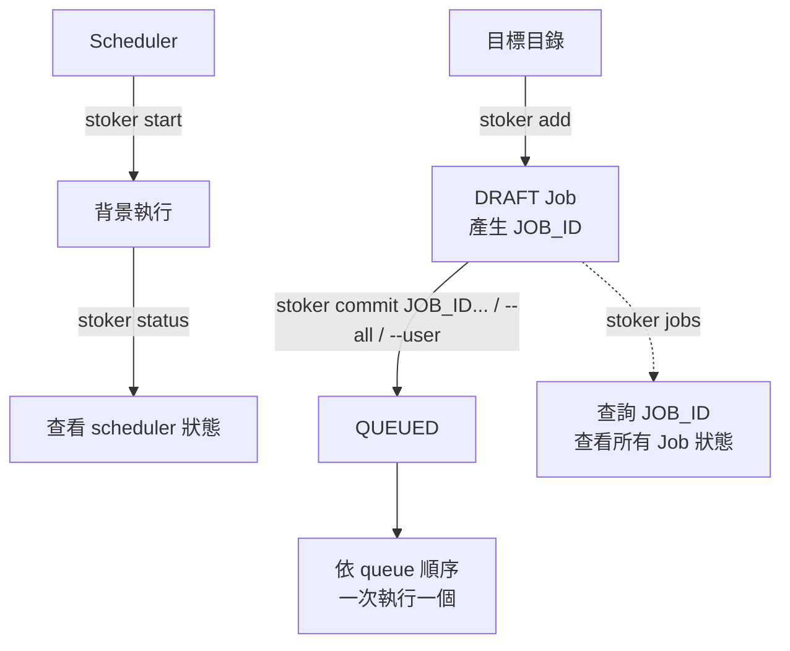

<h1 align="center">
  
</h1>
<br>

[](https://www.rust-lang.org/)

[](https://github.com/qinodes/stoker/actions/workflows/ci.yml)
[](https://codecov.io/gh/qinodes/stoker)
[](https://crates.io/crates/stoker-engine)
[](https://crates.io/crates/stoker-engine)
[](https://github.com/qinodes/stoker/blob/main/LICENSE)

[English](README.md) | [日本語](README.ja.md) | 繁體中文

**stoker 是一個讓多人共用同一台機器、將耗時任務依序執行的跨平台（Linux／macOS／Windows）CLI。**

當批次運算或資料處理需要長時間占用資源，Stoker 讓大家先把工作排進同一個佇列，由背景排程器一次執行一個任務，減少佇列內的任務同時爭用 GPU、CPU 或記憶體。

不用再問同事：「嘿，你正在用嗎？我可以用了嗎？」把工作排進佇列，輪到你時就會自動執行。

- **多人提交，集中排隊：** 支援多人同時提交任務，透過 CLI 或 Web UI 查看工作狀態、調整佇列順序。

- **先準備，再送出：** `stoker add` 先建立草稿 Job，確認後再用 `stoker commit` 加入執行佇列。

- **保留工作目錄：** 每個 Job 預設從執行 `stoker add` 時所在的資料夾啟動，方便提交不同專案的工作。

- **輕量常駐：** 以 Rust 打造，以低資源占用為設計目標，適合長時間在背景管理任務佇列，讓運算資源留給要執行的工作。

Job 狀態以本機 SQLite 保存，執行日誌也保留在本機；不需要另外架設 Redis、PostgreSQL 或其他外部資料庫服務。

## Web UI 展示

<p align="center">
  
</p>

Web UI 可以建立與查看 DRAFT Job、修改描述、commit 或取消 Job、管理 Queue、讀取 logs，以及管理時區、設定快照與 scheduler policy。

```bash
stoker start
stoker ui start --open
```

使用 `stoker ui status` 查看位址，使用 `stoker ui stop` 停止 UI server。預設只監聽 `127.0.0.1:8765`。

若要允許區域網路存取，請明確綁定非 loopback 位址：

```bash
stoker ui start --host 0.0.0.0 --port 8765
```

區域網路模式不使用額外的 token 驗證；請只在你信任的網路中綁定非 loopback 位址。

## 安裝

### 一行安裝指令（推薦）

安裝程式會下載最新版 release、驗證 SHA256、將 Stoker 安裝到目前使用者的目錄，並永久加入使用者層級的 `PATH`。不需要系統管理員權限。

**Windows PowerShell：**

```powershell
irm https://github.com/qinodes/stoker/releases/latest/download/stoker-install.ps1 | iex
```

安裝到 `%LOCALAPPDATA%\Programs\stoker`。

**Linux／macOS：**

```bash
curl --proto '=https' --tlsv1.2 -LsSf https://github.com/qinodes/stoker/releases/latest/download/stoker-install.sh | sh
```

安裝到 `~/.local/bin`。目前 release 支援 Linux x86_64 與 macOS Apple Silicon。

若要安裝指定的已發布版本，將網址中的 `latest` 替換成 release tag：

```powershell
irm https://github.com/qinodes/stoker/releases/download/v1.2.3/stoker-install.ps1 | iex
```

```bash
curl --proto '=https' --tlsv1.2 -LsSf https://github.com/qinodes/stoker/releases/download/v1.2.3/stoker-install.sh | sh
```

### 手動安裝

從 [GitHub Releases](https://github.com/qinodes/stoker/releases) 下載符合平台的壓縮檔，解壓縮 `stoker` 執行檔後加入 `PATH`：

- Windows：`stoker-windows-x86_64.zip`
- Linux：`stoker-linux-x86_64.tar.gz`
- macOS Apple Silicon：`stoker-macos-arm64.tar.gz`

下載的執行檔不會自動加入環境變數，請將執行檔所在的資料夾加入 `PATH`：

**Windows：** 在「環境變數」的「使用者變數」中編輯 `Path`，新增執行檔所在的資料夾，然後重新開啟終端機。

**macOS／Linux：** 將以下內容加入 `~/.zshrc`（macOS）或 `~/.bashrc`（Linux），把 `/path/to/stoker` 換成執行檔所在的實際資料夾，然後重新開啟終端機：

```bash
export PATH="/path/to/stoker:$PATH"
```

寫入後若要讓目前的終端機立即套用設定，可執行：

```bash
source ~/.bashrc  # Linux
source ~/.zshrc   # macOS
```


每個 release 也會提供平台 binary 與 `SHA256SUMS`。

### 使用 Cargo

```bash
cargo install stoker-engine
```

## 快速開始

### 基本流程

```bash
# 啟動背景 scheduler
stoker start

# 查看 scheduler 狀態
stoker status

# 在任務執行需要的根目錄下建立 DRAFT Job
# stoker add 會輸出 JOB_ID
stoker add --user alice --name exp-a --cmd "python train.py --lr 0.0001"

# 使用 stoker add 輸出的 JOB_ID 提交 Job
# 也可以使用 stoker jobs 查詢 JOB_ID
stoker commit <JOB_ID>

# 或將所有 DRAFT Job 依建立時間加入 queue
stoker commit --all

# 或將指定 user 的所有 DRAFT Job 依建立時間加入 queue
stoker commit --user alice

# 查看所有 Job 與目前狀態
stoker jobs
```



`--user` 是 stoker 的邏輯 owner 標籤，不是作業系統帳號或登入驗證。

### 指令參考

```bash

# 啟動背景 scheduler（Linux、macOS 與 Windows 皆適用）
stoker start

# 在目標目錄建立 DRAFT Job
stoker add --user <任意使用者名稱> --name <job名稱> --cmd "<待執行指令>"
# 例如: 
# stoker add --user alice --name exp-a --cmd "python train.py --lr 0.0001"

# 確認內容後加入 queue（<JOB_ID> 由上一個指令輸出）
# 查看Job設定細節
stoker show <JOB_ID>
# 送出Job(draft->queued)
stoker commit <JOB_ID>
# 一次送出多個 Job，依命令列輸入順序加入 queue
stoker commit <JOB_ID_1> <JOB_ID_2>
# 將所有 DRAFT Job 依建立時間加入 queue
stoker commit --all
# 將指定 user 的所有 DRAFT Job 依建立時間加入 queue
stoker commit --user <使用者名稱>

# 重新排序 queued Job 前先鎖定 queue，完成後明確解除鎖定
stoker queue lock
stoker queue edit
stoker status
stoker queue unlock

# 查詢與管理

# 查看 scheduler 狀態
stoker status

# 查看所有Job狀態
stoker jobs

# 查看指定Job狀態(篩選)
stoker jobs --user alice
stoker jobs --state draft
stoker jobs --state queued
# 組合篩選條件
stoker jobs --user alice --state failed

# 清除 SUCCEEDED、FAILED、CANCELLED、LOST Job 與其 logs
# scheduler 執行中也可以使用
stoker clean

# 查看目前已有的日誌，輸出完即結束。
stoker logs <JOB_ID>

# 持續顯示該 Job 新產生的 log，直到 Job 結束或你按 Ctrl+C
stoker logs -f <JOB_ID>

# 取消指定Job（DRAFT、QUEUED、STARTING、RUNNING、CANCELLING 都可以取消）
stoker cancel <JOB_ID>
# 在腳本中可加上 --yes 略過確認提示。

# 停止server(scheduler)
# 若有正在執行的 Job，stoker 會先詢問是否強制取消
# `QUEUED` Job 會保留，等下次啟動 scheduler 後再處理
stoker stop
# 在腳本中可加上 --yes 略過確認提示。

# 查看當前版本
stoker --version

# 更新到最新版
# 更新前要先停止 scheduler
stoker update
# 在腳本中可加上 --yes 略過確認提示。

# 解除安裝
# 解除前要先停止 scheduler
# Job 資料與 logs 會保留在 Stoker 資料夾（預設為 macOS／Linux 的 `~/.stoker`、Windows 的 `%USERPROFILE%\.stoker`）。
stoker uninstall
# 在腳本中可加上 --yes 略過確認提示。
```

`--cmd` 後面的完整指令必須用引號包住。

Job 會在背景執行，不具備互動式終端機。請使用非互動式指令與參數。

指令會交由平台的 shell 執行：Linux／macOS 使用 `sh`，Windows 使用
`cmd.exe`，因此 shell 語法與可用程式可能因平台不同。

## 使用 Docker 執行任務

如果任務是在 Docker container 中執行，且希望 Stoker 等待 container 結束後才執行下一個 Job，請使用前景模式：

```bash
docker run <IMAGE> <COMMAND>
```

此時不要使用 `docker run -d`。背景模式會在 container 啟動後立即返回，Stoker 會視為指令已完成，接著執行下一個 queued Job。

## Job 狀態與取消

| 狀態 | 說明 |
| --- | --- |
| `DRAFT` | 已 add，但尚未 commit 到 queue。 |
| `QUEUED` | 已 commit，正在等待執行。 |
| `STARTING` | scheduler 已取出 Job，正在準備來源目錄與程序。 |
| `RUNNING` | Job 的程序正在執行。 |
| `CANCELLING` | 已要求取消，stoker 正在停止程序並清理。 |
| `SUCCEEDED` | Job 已成功完成。 |
| `FAILED` | Job 程序失敗，或 stoker 無法完成執行流程。 |
| `CANCELLED` | Job 已被取消。 |
| `LOST` | scheduler 重啟時，發現先前執行中的 Job 已失去管理。 |

## Queue 鎖定與編輯器

可以透過`stoker status` 確認Queue狀態。

修改 queue 前先執行 `stoker queue lock`，完成修改後執行 `stoker queue unlock`。

鎖定時不能執行 `stoker commit`、`stoker commit --all` 或 `stoker commit --user`，但仍可 `cancel` 或 `add`。

`stoker queue edit` 必須在鎖定後使用。

編輯器只顯示依執行順序排列的 `QUEUED` Job：

| 模式 | 按鍵 | 動作 |
| --- | --- | --- |
| 瀏覽 | `↑` / `↓` | 選取 Job。 |
| 瀏覽 | `Enter` | 對選取的 Job 進入移動模式。 |
| 瀏覽 | `q` / `Esc` | 離開編輯器並保持 queue 鎖定。 |
| 移動 | `↑` / `↓` | 調整選取 Job 的位置。 |
| 移動 | `Enter` | 保留移動結果並返回瀏覽模式。 |
| 移動 | `q` / `Esc` | 只復原目前這次移動，並返回瀏覽模式。 |

## 時區設定

SQLite 內的時間一律以 UTC 保存；`stoker jobs` 與 `stoker show` 顯示時，才依照顯示時區轉換，並保留 RFC3339 offset。

首次初始化 Stoker 資料夾時，會偵測作業系統的 IANA 時區並寫入：

```text
~/.stoker/config.json
```

設定內容例如：

```json
{
  "timezone": "Asia/Taipei"
}
```

設定或查詢時區：

```bash
stoker config show
stoker config set timezone Asia/Taipei
stoker config get timezone
stoker config unset timezone
```

`stoker config show` 只顯示 config 檔案位置與時區設定。

省略時區值時，Stoker 會開啟互動式選擇器：

```bash
stoker config set timezone
```

當 Stoker 建立或更新 `config.json` 時，會在下列位置保留帶有時間戳的 snapshot：

```text
~/.stoker/snapshot/
```

如果要在進行高風險變更前主動建立 snapshot，可以執行：

```bash
stoker config snapshot
```

即使設定內容沒有變更，這個指令仍然會建立一份新的 snapshot。

使用互動式還原畫面選擇 snapshot：

```bash
# 最新的 snapshot 會排在最上方；使用方向鍵選擇、按 `Enter` 查看唯讀詳細內容、按 `Esc` 或 `q` 回到清單，最後按 `Enter` 再按 `y` 確認還原
# 還原前會先把目前的設定保存成新的 snapshot。
stoker config restore
```

單次指令可以用 `--timezone` 或較短的 `--tz` 覆寫設定：

```bash
stoker jobs --tz Asia/Tokyo
stoker show <JOB_ID> --timezone UTC
```

解析優先順序為 CLI 參數、`config.json`、作業系統時區。

## Log 容量與執行策略

Log 有安全的預設上限，只保留最新尾端內容：

| 設定 | 預設值 | 用途 |
| --- | ---: | --- |
| `log-max-bytes-per-job`（stdout + stderr） | 64 MB | 單一 Job 共用的 log 上限；超過後會淘汰較舊的分段。 |
| `log-segment-bytes` | 1 MB | 每個輪替 log 分段的大小。 |
| `log-max-bytes-total`（terminal Job） | 1024 MB | 所有已結束 Job 保留 log 檔案的總上限。 |
| `log-retention-jobs` | 100 | 保留 log 檔案的最新 terminal Job 數量。 |
| `log-disk-reserve-bytes` | 512 MB | 最低可用磁碟空間；低於此值時 scheduler 會阻擋新的 queued Job。 |
| `termination-grace-ms` | 500 | 取消後等待正常終止，再進行強制終止的寬限時間。 |
| `startup-timeout-ms` | 30,000 | 建立 run directory、log 檔與檢查工作目錄的最長時間。 |
| `max-runtime-ms` | 停用 | Job 可設定的最長執行時間；停用表示不會自動因逾時取消。 |

修改前必須先鎖定 queue，且不能有 `STARTING`、`RUNNING` 或 `CANCELLING` Job；queued Job 可以保留：

Log 容量請輸入不帶單位的整數 MB（例如 `256`）。

```bash
stoker queue lock
stoker policy set log-max-bytes-per-job 256
stoker policy set log-retention-jobs 30
stoker policy set termination-grace-ms 30000
stoker policy set max-runtime-ms 43200000
stoker policy unset max-runtime-ms
stoker queue unlock
```

使用 `stoker policy show` 或 `stoker policy get <KEY>` 查看 policy 數值。容量用盡或 log 寫入失敗時仍會持續讀取子程序輸出，舊分段可能被丟棄，CLI 會提示 log 已截斷。可用空間低於 reserve 時，scheduler 不會啟動下一個 queued Job；`stoker status` 會顯示警告。

## Flow 與排程 Job

Flow 可以把多個 task 組成一次執行，並宣告成功或失敗相依關係：

### 正式 Flow 命令接口

以下是目前提供給使用者的完整 Flow command tree。`FLOW_ID` 與 `TASK_ID` 是 positional argument；用來選擇執行紀錄的 `RUN_ID`、task 與 attempt 則固定使用 option。

~~~text
stoker flow create <FLOW_ID> --user <USER> --name <NAME> --at <RFC3339>
stoker flow create <FLOW_ID> --user <USER> --name <NAME> --daily <HH:mm> [--schedule-timezone <ZONE>]
stoker flow commit <FLOW_ID>
stoker flow list [--user <USER>]
stoker flow show <FLOW_ID> [--run <RUN_ID> [--task <TASK_ID>]]
stoker flow runs <FLOW_ID>
stoker flow occurrences <FLOW_ID>

stoker flow run <FLOW_ID> [--replace-next] [--request-id <UUID>]
stoker flow logs <FLOW_ID> --run <RUN_ID> --task <TASK_ID> [--attempt <N>] [--follow]
stoker flow cancel <FLOW_ID> --run <RUN_ID> [--task <TASK_ID>]

stoker flow task add <FLOW_ID> <TASK_ID> --name <NAME> --cmd <COMMAND>
    [--after <TASK_ID>]... [--after-failure <TASK_ID>]...
    [--match all|any] [--retries <N>] [--revision <N>]

stoker flow task update <FLOW_ID> <TASK_ID>
    [--cmd <COMMAND>] [--cwd <DIR>] [--retries <N>]
    [--after <TASK_ID>]... [--after-failure <TASK_ID>]...
    [--match all|any] [--clear-dependencies] [--revision <N>]

stoker flow task remove <FLOW_ID> <TASK_ID>
    [--scope future|current|both] [--run <RUN_ID>] [--revision <N>]

stoker flow schedule set <FLOW_ID> --at <RFC3339> [--revision <N>]
stoker flow schedule set <FLOW_ID> --daily <HH:mm> [--schedule-timezone <ZONE>] [--revision <N>]
stoker flow schedule set <FLOW_ID> --schedule-timezone <ZONE> [--revision <N>]

stoker flow edit begin <FLOW_ID>
stoker flow edit apply <FLOW_ID> [--revision <N>]
stoker flow edit discard <FLOW_ID> --revision <N>

stoker flow disable <FLOW_ID>
stoker flow enable <FLOW_ID>
~~~

重要參數規則：

- `--after TASK_ID` 表示上游 task 成功後才符合條件；`--after-failure TASK_ID` 表示上游失敗後才符合條件。兩者都可重複指定。
- `--match all|any` 控制多個 dependency 必須全部符合或任一符合。
- `--retries N` 是失敗後可重試的次數；`0` 表示不重試。
- `--revision N` 是 draft 的 compare-and-swap revision。revision 不符時不會套用修改。
- `--attempt N` 從 `1` 開始。省略時，`flow logs` 會顯示該 task 的全部 attempts。
- `--cmd` 接受一整段交給平台 shell 執行的 command string；含空白或 shell operator 時請加引號。
- `flow edit discard` 只丟棄 draft，Flow 仍維持 frozen；必須再執行 `flow edit apply` 才會解除 freeze。
- Flow 只存在於 `scheduled` mode。切換 mode 前後的 queue lock 不會由 Flow 命令自動解除。

~~~bash
# 建立 scheduled definition 前先切換 workspace mode
stoker mode set scheduled
stoker queue unlock

# 建立 scheduled flow
stoker flow create nightly --user alice --name nightly --daily 23:30 --schedule-timezone Asia/Tokyo

# 從 task 應執行的資料夾加入 task
stoker flow task add nightly prepare --name prepare --cmd "python prepare.py"
stoker flow task add nightly train --name train --cmd "python train.py" --after prepare
stoker flow commit nightly

~~~

### Flow CLI 完整參考

下表使用 `nightly` 作為 `FLOW_ID`、`prepare`／`train` 作為 `TASK_ID`。`RUN_UUID`、`REQUEST_UUID` 與 `OCCURRENCE_UUID` 是 Stoker 輸出的 UUID，請換成實際值。

| 用途 | 命令 | 功能與重要選項 | 成功輸出範例 |
|---|---|---|---|
| 查看模式 | `stoker mode show` | 顯示目前 workspace 的 `serial` 或 `scheduled` 模式。 | `scheduled` |
| 切換模式 | `stoker mode set serial`<br>`stoker mode set scheduled` | 切換前會鎖住 queue；成功後仍保持 locked，確認完成後需執行 `stoker queue unlock`。 | `Mode set to scheduled; queue remains locked.` |
| 建立 Flow | `stoker flow create nightly --user alice --name nightly --at 2026-09-20T10:00:00+09:00`<br>`stoker flow create nightly --user alice --name nightly --daily 23:30 --schedule-timezone Asia/Tokyo` | Flow 只適用於 `scheduled` mode，必須選擇 `--at RFC3339` 或 `--daily HH:mm`；daily timezone 使用 IANA 名稱。serial 立即執行請使用 standalone `stoker add`。 | `Created flow nightly (DRAFT, draft revision 0).` |
| 新增 task | `stoker flow task add nightly prepare --name prepare --cmd "python prepare.py"` | 從目前目錄新增 task。可加 `--retries N`、重複的 `--after TASK_ID`／`--after-failure TASK_ID`、`--match all\|any` 及 `--revision N`。 | `Added task to flow nightly (draft revision 0).` |
| 提交 Flow | `stoker flow commit nightly` | 驗證完整 task graph 並提交 draft；提交後 scheduler 才能執行。 | `Committed flow nightly (2 task(s)).` |
| 列出 Flow | `stoker flow list [--user alice]` | 每個 Flow 顯示一列對齊摘要，包含排程、狀態、active run 與下次觸發時間，不展開 tasks。 | `FLOW_ID  NAME  USER  SCHEDULE  STATUS  ACTIVE  NEXT` |
| 查看定義 | `stoker flow show nightly` | 顯示 Flow 定義、狀態、排程、revision、task ID 與 dependency。 | `flow_id=nightly ... committed=true frozen=false enabled=true ...`<br>`task_id=train ... depends_on=prepare:succeeded` |
| 手動執行 | `stoker flow run nightly [--replace-next] [--request-id REQUEST_UUID]` | 建立 manual run。`--replace-next` 會在本次執行開始後取代下一個排程 occurrence；重送相同 `--request-id` 會取得同一結果。 | `Created flow run RUN_UUID for nightly (request-id REQUEST_UUID).` |
| 列出 runs | `stoker flow runs nightly` | 以對齊的欄位列出全部執行紀錄；`RUN_ID` 欄就是後續命令使用的 `RUN_UUID`。 | 見下方完整輸出。 |
| 查看 run | `stoker flow show nightly --run RUN_UUID` | 顯示單次 run 的來源、整體狀態及每個 task 的狀態／attempt 數。 | `run_id=RUN_UUID flow_id=nightly source=MANUAL state=Succeeded`<br>`task_id=prepare state=Succeeded attempts=1` |
| 列出 occurrences | `stoker flow occurrences nightly` | 以對齊的欄位列出自動排程 occurrence、UTC 到期時間、狀態及原因。 | 見下方完整輸出。 |
| 查看 task run | `stoker flow show nightly --run RUN_UUID --task prepare` | 將指定 run 篩選為單一 task，顯示其狀態及 attempt 次數。 | `task_id=prepare state=Succeeded attempts=1` |
| 查看 task log | `stoker flow logs nightly --run RUN_UUID --task prepare [--attempt N] [-f]` | 顯示 stdout/stderr；省略 `--attempt` 時顯示全部 attempts，`-f`／`--follow` 持續追蹤到 task 結束。 | `--- .../attempt-1/stdout.log ---`<br>`task output` |
| 取消 Flow run | `stoker flow cancel nightly --run RUN_UUID` | 要求取消指定 run 及尚未完成的 tasks。 | `Cancelled flow run RUN_UUID (Cancelling).` |
| 取消 task | `stoker flow cancel nightly --run RUN_UUID --task prepare` | 只取消指定 run 中的 task；執行中的 task 會先進入 cancelling。 | `Cancelled task prepare in run RUN_UUID (Cancelling).` |
| 開始編輯 | `stoker flow edit begin nightly` | 凍結已提交 Flow，暫停新的 run、task 與 retry intake，並建立可安全修改的 future draft；執行中的程序會繼續。 | `Flow 'nightly' is frozen for editing.` |
| 修改 task | `stoker flow task update nightly train [--cmd CMD] [--cwd DIR] [--retries N] [--after TASK] [--after-failure TASK] [--match all\|any] [--clear-dependencies] [--revision N]` | 修改 future draft；至少指定一個欄位，相依選項可重複。 | `Updated task train in flow nightly (draft revision 1).` |
| 移除 task | `stoker flow task remove nightly train [--scope future\|current\|both] [--run RUN_UUID] [--revision N]` | 預設修改 `future`。`current`／`both` 用於指定的 active run，必須提供 `--run`；操作要求 Flow 已 freeze。 | `Draft revision 2 for flow nightly.` |
| 修改排程 | `stoker flow schedule set nightly --at 2026-09-20T10:00:00+09:00`<br>`stoker flow schedule set nightly --daily 23:30 --schedule-timezone Asia/Tokyo`<br>`stoker flow schedule set nightly --schedule-timezone UTC` | 修改 frozen Flow 的 future 排程。timezone-only 只適用於既有 daily 排程；可加 `--revision N`。 | `Updated flow nightly draft revision 2.` |
| 放棄 draft | `stoker flow edit discard nightly --revision N` | 放棄尚未套用的 future 修改；Flow 仍保持 frozen。 | `Discarded draft for nightly (still frozen=true).` |
| 套用編輯 | `stoker flow edit apply nightly [--revision N]` | 驗證並套用 future draft，增加 graph revision，然後解除 Flow freeze；不會解除全域 queue lock。 | `Applied edits to nightly (graph revision 2).` |
| 停用自動觸發 | `stoker flow disable nightly` | 停止未來的 automatic trigger；合法的 manual run 仍可執行。 | `Disabled nightly.` |
| 啟用自動觸發 | `stoker flow enable nightly` | 恢復未來的 automatic trigger。 | `Enabled nightly.` |
| 查詢冪等請求 | `stoker request show REQUEST_UUID` | 以 manual run 的 request ID 查詢對應 Flow、run UUID 與結果。 | `request_id=REQUEST_UUID flow_id=nightly run_id=RUN_UUID result=CREATED` |
| 復原 reconcile | `stoker recovery reconcile RUN_UUID --confirm-stopped` | 僅在 run 因重啟進入 `Recovering`，且已人工確認程序停止後使用。全部 recovery 解決後才能 unlock queue。 | `Reconciled recovery for RUN_UUID; queue may be unlocked after all recoveries are resolved.` |

`flow runs` 的欄位會依實際內容計算寬度並對齊：

```text
RUN_ID                                FLOW_ID  STATE     SOURCE
------------------------------------  -------  --------  ------
2238b174-1480-48c0-b1b7-e8ce36bca1b7  nightly  Starting  MANUAL
```

`flow occurrences` 也使用相同的對齊格式；`DUE_AT_UTC` 固定顯示 UTC：

```text
OCCURRENCE_ID                         FLOW_ID  STATE    DUE_AT_UTC                 REASON
------------------------------------  -------  -------  -------------------------  ------
6560cda6-92a3-4429-955a-16aa3a1c3618  nightly  Pending  2099-01-01T00:00:00+00:00
```

Flow 命令一律以 `stoker flow` 開頭；頂層 scheduled-job 命令只接受 standalone job UUID。完整參數可用 `stoker flow --help`、`stoker flow task --help` 及各子命令的 `--help` 查看。

`Succeeded` 表示整個 run 成功；`Starting`／`Running` 表示尚未結束；`Failed`／`FailedToStart` 表示失敗；`Cancelled` 表示已取消。執行 `stoker flow run` 後，可依序用 `flow runs` 取得 `RUN_UUID`、`flow show --run` 查看整體狀態，再用 `flow logs` 檢查輸出。

One-time schedule 使用包含秒數與明確 UTC offset 的 RFC 3339，例如
2026-09-15T23:30:00+09:00。Daily schedule 使用 HH:mm 與 IANA timezone。
錯過的 daily occurrence 不會補跑；DST 不存在的時間會跳過，重複的時間採用
較早的 instant。

要修改已 commit 的 flow，先開始 edit，再修改 future draft，最後套用；可使用
draft revision 做 compare-and-swap：

~~~bash
stoker flow edit begin nightly
stoker flow task update nightly train --retries 2 --revision 0
stoker flow edit apply nightly --revision 1
~~~

若重啟後 run 留在 RECOVERING，請先確認 process 已停止，再 reconcile，最後
解除 queue lock：

~~~bash
stoker recovery reconcile <RUN_ID> --confirm-stopped
stoker queue unlock
~~~

## SQLite 檢查與復原

```bash
stoker db check
stoker db check --integrity
stoker db backup
stoker db backup <BACKUP_PATH>
```

不指定目的地時，`stoker db backup` 會將帶時間戳的備份寫入 `<STOKER_HOME>/backups/`（通常是 `~/.stoker/backups/`），並輸出實際路徑；指定目的地時則直接寫入該路徑。`backup` 會包含 SQLite WAL 內容。還原前必須停止 scheduler，並確認備份檔案：

```bash
stoker db restore <BACKUP_PATH> --yes
```

`restore` 會以 `--yes` 明確確認取代目前資料庫。scheduler 中斷後，進行中的 Job 會標為 `LOST` 並鎖住 queue；請先人工檢查與處理，再執行 `stoker queue unlock`。Stoker 不會自動重試，也不保證外部副作用 exactly-once。


## 補充說明

command 對來源目錄的檔案變更會保留。stoker 不會自動修改或還原目錄中的檔案。

安裝指定版本:

`cargo install stoker-engine --version <VERSION> --force`。

logs 保存於 `.stoker/runs/<JOB_ID>/stdout.log` 與 `.stoker/runs/<JOB_ID>/stderr.log`。

## 邊界與限制

- 只支援單機 queue；不做多機、遠端執行、分散式訓練、GPU 數量或容器排程。
- add 時的工作目錄必須存在且是目錄；不檢查目錄中的檔案變更。
- stoker 不管理 Python/Conda/CUDA 等環境，也不管理資料集、checkpoint、artifact 或實驗指標。
- 不提供 stoker 帳號、登入、權限控制；`--user` 只用於辨識與篩選。
