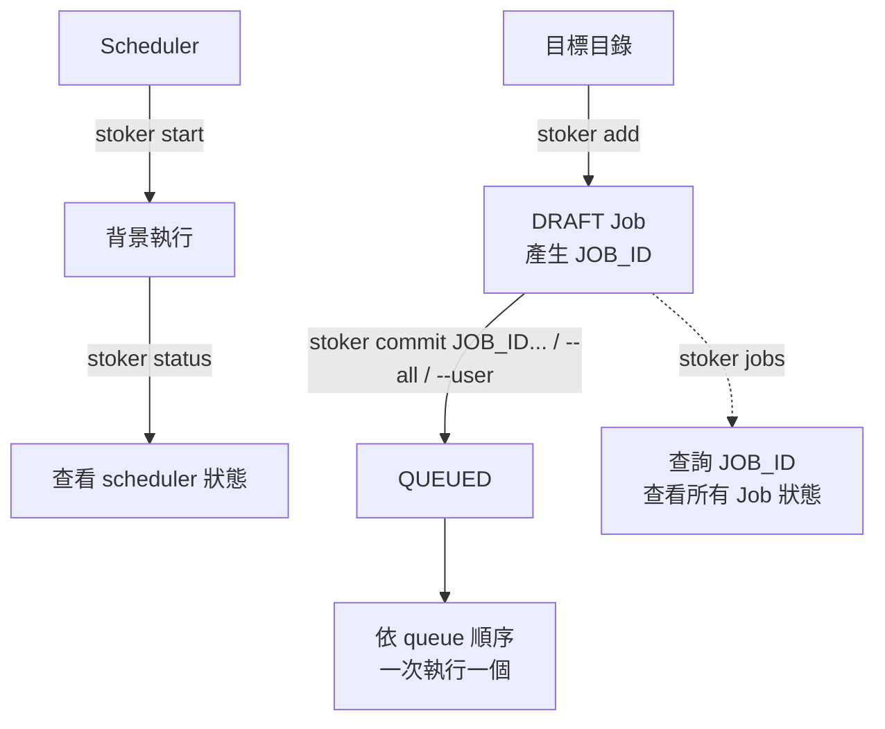

<h1 align="center">
  
</h1>
<br>

[](https://www.rust-lang.org/)

[](https://github.com/qinodes/stoker/actions/workflows/ci.yml)
[](https://codecov.io/gh/qinodes/stoker)
[](https://crates.io/crates/stoker-engine)
[](https://crates.io/crates/stoker-engine)
[](https://github.com/qinodes/stoker/blob/main/LICENSE)

[English](README.md) | [日本語](README.ja.md) | 繁體中文

**stoker 是一個讓多人共用同一台機器、將耗時任務依序執行的跨平台（Linux／macOS／Windows）CLI。**

當批次運算或資料處理需要長時間占用資源，Stoker 讓大家先把工作排進同一個佇列，由背景排程器一次執行一個任務，減少佇列內的任務同時爭用 GPU、CPU 或記憶體。

不用再問同事：「嘿，你正在用嗎？我可以用了嗎？」把工作排進佇列，輪到你時就會自動執行。

- **多人提交，集中排隊：** 支援多人同時提交任務，透過 CLI 或 Web UI 查看工作狀態、調整佇列順序。

- **先準備，再送出：** `stoker add` 先建立草稿 Job，確認後再用 `stoker commit` 加入執行佇列。

- **保留工作目錄：** 每個 Job 預設從執行 `stoker add` 時所在的資料夾啟動，方便提交不同專案的工作。

- **輕量常駐：** 以 Rust 打造，以低資源占用為設計目標，適合長時間在背景管理任務佇列，讓運算資源留給要執行的工作。

Job 狀態以本機 SQLite 保存，執行日誌也保留在本機；不需要另外架設 Redis、PostgreSQL 或其他外部資料庫服務。

## Web UI 展示

<p align="center">
  
</p>

Web UI 可以建立與查看 DRAFT Job、修改描述、commit 或取消 Job、管理 Queue、讀取 logs，以及管理時區、設定快照與 scheduler policy。

```bash
stoker start
stoker ui start --open
```

使用 `stoker ui status` 查看位址，使用 `stoker ui stop` 停止 UI server。預設只監聽 `127.0.0.1:8765`。

若要允許區域網路存取，請明確綁定非 loopback 位址：

```bash
stoker ui start --host 0.0.0.0 --port 8765
```

區域網路模式不使用額外的 token 驗證；請只在你信任的網路中綁定非 loopback 位址。

## 安裝

### 一行安裝指令（推薦）

安裝程式會下載最新版 release、驗證 SHA256、將 Stoker 安裝到目前使用者的目錄，並永久加入使用者層級的 `PATH`。不需要系統管理員權限。

**Windows PowerShell：**

```powershell
irm https://github.com/qinodes/stoker/releases/latest/download/stoker-install.ps1 | iex
```

安裝到 `%LOCALAPPDATA%\Programs\stoker`。

**Linux／macOS：**

```bash
curl --proto '=https' --tlsv1.2 -LsSf https://github.com/qinodes/stoker/releases/latest/download/stoker-install.sh | sh
```

安裝到 `~/.local/bin`。目前 release 支援 Linux x86_64 與 macOS Apple Silicon。

若要安裝指定的已發布版本，將網址中的 `latest` 替換成 release tag：

```powershell
irm https://github.com/qinodes/stoker/releases/download/v1.2.3/stoker-install.ps1 | iex
```

```bash
curl --proto '=https' --tlsv1.2 -LsSf https://github.com/qinodes/stoker/releases/download/v1.2.3/stoker-install.sh | sh
```

### 手動安裝

從 [GitHub Releases](https://github.com/qinodes/stoker/releases) 下載符合平台的壓縮檔，解壓縮 `stoker` 執行檔後加入 `PATH`：

- Windows：`stoker-windows-x86_64.zip`
- Linux：`stoker-linux-x86_64.tar.gz`
- macOS Apple Silicon：`stoker-macos-arm64.tar.gz`

下載的執行檔不會自動加入環境變數，請將執行檔所在的資料夾加入 `PATH`：

**Windows：** 在「環境變數」的「使用者變數」中編輯 `Path`，新增執行檔所在的資料夾，然後重新開啟終端機。

**macOS／Linux：** 將以下內容加入 `~/.zshrc`（macOS）或 `~/.bashrc`（Linux），把 `/path/to/stoker` 換成執行檔所在的實際資料夾，然後重新開啟終端機：

```bash
export PATH="/path/to/stoker:$PATH"
```

寫入後若要讓目前的終端機立即套用設定，可執行：

```bash
source ~/.bashrc  # Linux
source ~/.zshrc   # macOS
```


每個 release 也會提供平台 binary 與 `SHA256SUMS`。

### 使用 Cargo

```bash
cargo install stoker-engine
```

## 快速開始

### 基本流程

```bash
# 啟動背景 scheduler
stoker start

# 查看 scheduler 狀態
stoker status

# 在任務執行需要的根目錄下建立 DRAFT Job
# stoker add 會輸出 JOB_ID
stoker add --user alice --name exp-a --cmd "python train.py --lr 0.0001"

# 使用 stoker add 輸出的 JOB_ID 提交 Job
# 也可以使用 stoker jobs 查詢 JOB_ID
stoker commit <JOB_ID>

# 或將所有 DRAFT Job 依建立時間加入 queue
stoker commit --all

# 或將指定 user 的所有 DRAFT Job 依建立時間加入 queue
stoker commit --user alice

# 查看所有 Job 與目前狀態
stoker jobs
```



`--user` 是 stoker 的邏輯 owner 標籤，不是作業系統帳號或登入驗證。

### 指令參考

```bash

# 啟動背景 scheduler（Linux、macOS 與 Windows 皆適用）
stoker start

# 在目標目錄建立 DRAFT Job
stoker add --user <任意使用者名稱> --name <job名稱> --cmd "<待執行指令>"
# 例如: 
# stoker add --user alice --name exp-a --cmd "python train.py --lr 0.0001"

# 確認內容後加入 queue（<JOB_ID> 由上一個指令輸出）
# 查看Job設定細節
stoker show <JOB_ID>
# 送出Job(draft->queued)
stoker commit <JOB_ID>
# 一次送出多個 Job，依命令列輸入順序加入 queue
stoker commit <JOB_ID_1> <JOB_ID_2>
# 將所有 DRAFT Job 依建立時間加入 queue
stoker commit --all
# 將指定 user 的所有 DRAFT Job 依建立時間加入 queue
stoker commit --user <使用者名稱>

# 重新排序 queued Job 前先鎖定 queue，完成後明確解除鎖定
stoker queue lock
stoker queue edit
stoker status
stoker queue unlock

# 查詢與管理

# 查看 scheduler 狀態
stoker status

# 查看所有Job狀態
stoker jobs

# 查看指定Job狀態(篩選)
stoker jobs --user alice
stoker jobs --state draft
stoker jobs --state queued
# 組合篩選條件
stoker jobs --user alice --state failed

# 清除 SUCCEEDED、FAILED、CANCELLED、LOST Job 與其 logs
# scheduler 執行中也可以使用
stoker clean

# 查看目前已有的日誌，輸出完即結束。
stoker logs <JOB_ID>

# 持續顯示該 Job 新產生的 log，直到 Job 結束或你按 Ctrl+C
stoker logs -f <JOB_ID>

# 取消指定Job（DRAFT、QUEUED、STARTING、RUNNING、CANCELLING 都可以取消）
stoker cancel <JOB_ID>
# 在腳本中可加上 --yes 略過確認提示。

# 停止server(scheduler)
# 若有正在執行的 Job，stoker 會先詢問是否強制取消
# `QUEUED` Job 會保留，等下次啟動 scheduler 後再處理
stoker stop
# 在腳本中可加上 --yes 略過確認提示。

# 查看當前版本
stoker --version

# 更新到最新版
# 更新前要先停止 scheduler
stoker update
# 在腳本中可加上 --yes 略過確認提示。

# 解除安裝
# 解除前要先停止 scheduler
# Job 資料與 logs 會保留在 Stoker 資料夾（預設為 macOS／Linux 的 `~/.stoker`、Windows 的 `%USERPROFILE%\.stoker`）。
stoker uninstall
# 在腳本中可加上 --yes 略過確認提示。
```

`--cmd` 後面的完整指令必須用引號包住。

Job 會在背景執行，不具備互動式終端機。請使用非互動式指令與參數。

指令會交由平台的 shell 執行：Linux／macOS 使用 `sh`，Windows 使用
`cmd.exe`，因此 shell 語法與可用程式可能因平台不同。

## 使用 Docker 執行任務

如果任務是在 Docker container 中執行，且希望 Stoker 等待 container 結束後才執行下一個 Job，請使用前景模式：

```bash
docker run <IMAGE> <COMMAND>
```

此時不要使用 `docker run -d`。背景模式會在 container 啟動後立即返回，Stoker 會視為指令已完成，接著執行下一個 queued Job。

## Job 狀態與取消

| 狀態 | 說明 |
| --- | --- |
| `DRAFT` | 已 add，但尚未 commit 到 queue。 |
| `QUEUED` | 已 commit，正在等待執行。 |
| `STARTING` | scheduler 已取出 Job，正在準備來源目錄與程序。 |
| `RUNNING` | Job 的程序正在執行。 |
| `CANCELLING` | 已要求取消，stoker 正在停止程序並清理。 |
| `SUCCEEDED` | Job 已成功完成。 |
| `FAILED` | Job 程序失敗，或 stoker 無法完成執行流程。 |
| `CANCELLED` | Job 已被取消。 |
| `LOST` | scheduler 重啟時，發現先前執行中的 Job 已失去管理。 |

## Queue 鎖定與編輯器

可以透過`stoker status` 確認Queue狀態。

修改 queue 前先執行 `stoker queue lock`，完成修改後執行 `stoker queue unlock`。

鎖定時不能執行 `stoker commit`、`stoker commit --all` 或 `stoker commit --user`，但仍可 `cancel` 或 `add`。

`stoker queue edit` 必須在鎖定後使用。

編輯器只顯示依執行順序排列的 `QUEUED` Job：

| 模式 | 按鍵 | 動作 |
| --- | --- | --- |
| 瀏覽 | `↑` / `↓` | 選取 Job。 |
| 瀏覽 | `Enter` | 對選取的 Job 進入移動模式。 |
| 瀏覽 | `q` / `Esc` | 離開編輯器並保持 queue 鎖定。 |
| 移動 | `↑` / `↓` | 調整選取 Job 的位置。 |
| 移動 | `Enter` | 保留移動結果並返回瀏覽模式。 |
| 移動 | `q` / `Esc` | 只復原目前這次移動，並返回瀏覽模式。 |

## 時區設定

SQLite 內的時間一律以 UTC 保存；`stoker jobs` 與 `stoker show` 顯示時，才依照顯示時區轉換，並保留 RFC3339 offset。

首次初始化 Stoker 資料夾時，會偵測作業系統的 IANA 時區並寫入：

```text
~/.stoker/config.json
```

設定內容例如：

```json
{
  "timezone": "Asia/Taipei"
}
```

設定或查詢時區：

```bash
stoker config show
stoker config set timezone Asia/Taipei
stoker config get timezone
stoker config unset timezone
```

`stoker config show` 只顯示 config 檔案位置與時區設定。

省略時區值時，Stoker 會開啟互動式選擇器：

```bash
stoker config set timezone
```

當 Stoker 建立或更新 `config.json` 時，會在下列位置保留帶有時間戳的 snapshot：

```text
~/.stoker/snapshot/
```

如果要在進行高風險變更前主動建立 snapshot，可以執行：

```bash
stoker config snapshot
```

即使設定內容沒有變更，這個指令仍然會建立一份新的 snapshot。

使用互動式還原畫面選擇 snapshot：

```bash
# 最新的 snapshot 會排在最上方；使用方向鍵選擇、按 `Enter` 查看唯讀詳細內容、按 `Esc` 或 `q` 回到清單，最後按 `Enter` 再按 `y` 確認還原
# 還原前會先把目前的設定保存成新的 snapshot。
stoker config restore
```

單次指令可以用 `--timezone` 或較短的 `--tz` 覆寫設定：

```bash
stoker jobs --tz Asia/Tokyo
stoker show <JOB_ID> --timezone UTC
```

解析優先順序為 CLI 參數、`config.json`、作業系統時區。

## Log 容量與執行策略

Log 有安全的預設上限，只保留最新尾端內容：

| 設定 | 預設值 | 用途 |
| --- | ---: | --- |
| `log-max-bytes-per-job`（stdout + stderr） | 64 MB | 單一 Job 共用的 log 上限；超過後會淘汰較舊的分段。 |
| `log-segment-bytes` | 1 MB | 每個輪替 log 分段的大小。 |
| `log-max-bytes-total`（terminal Job） | 1024 MB | 所有已結束 Job 保留 log 檔案的總上限。 |
| `log-retention-jobs` | 100 | 保留 log 檔案的最新 terminal Job 數量。 |
| `log-disk-reserve-bytes` | 512 MB | 最低可用磁碟空間；低於此值時 scheduler 會阻擋新的 queued Job。 |
| `termination-grace-ms` | 500 | 取消後等待正常終止，再進行強制終止的寬限時間。 |
| `startup-timeout-ms` | 30,000 | 建立 run directory、log 檔與檢查工作目錄的最長時間。 |
| `max-runtime-ms` | 停用 | Job 可設定的最長執行時間；停用表示不會自動因逾時取消。 |

修改前必須先鎖定 queue，且不能有 `STARTING`、`RUNNING` 或 `CANCELLING` Job；queued Job 可以保留：

Log 容量請輸入不帶單位的整數 MB（例如 `256`）。

```bash
stoker queue lock
stoker policy set log-max-bytes-per-job 256
stoker policy set log-retention-jobs 30
stoker policy set termination-grace-ms 30000
stoker policy set max-runtime-ms 43200000
stoker policy unset max-runtime-ms
stoker queue unlock
```

使用 `stoker policy show` 或 `stoker policy get <KEY>` 查看 policy 數值。容量用盡或 log 寫入失敗時仍會持續讀取子程序輸出，舊分段可能被丟棄，CLI 會提示 log 已截斷。可用空間低於 reserve 時，scheduler 不會啟動下一個 queued Job；`stoker status` 會顯示警告。

## SQLite 檢查與復原

```bash
stoker db check
stoker db check --integrity
stoker db backup
stoker db backup <BACKUP_PATH>
```

不指定目的地時，`stoker db backup` 會將帶時間戳的備份寫入 `<STOKER_HOME>/backups/`（通常是 `~/.stoker/backups/`），並輸出實際路徑；指定目的地時則直接寫入該路徑。`backup` 會包含 SQLite WAL 內容。還原前必須停止 scheduler，並確認備份檔案：

```bash
stoker db restore <BACKUP_PATH> --yes
```

`restore` 會以 `--yes` 明確確認取代目前資料庫。scheduler 中斷後，進行中的 Job 會標為 `LOST` 並鎖住 queue；請先人工檢查與處理，再執行 `stoker queue unlock`。Stoker 不會自動重試，也不保證外部副作用 exactly-once。


## 補充說明

command 對來源目錄的檔案變更會保留。stoker 不會自動修改或還原目錄中的檔案。

安裝指定版本:

`cargo install stoker-engine --version <VERSION> --force`。

logs 保存於 `.stoker/runs/<JOB_ID>/stdout.log` 與 `.stoker/runs/<JOB_ID>/stderr.log`。

## 邊界與限制

- 只支援單機 queue；不做多機、遠端執行、分散式訓練、GPU 數量或容器排程。
- add 時的工作目錄必須存在且是目錄；不檢查目錄中的檔案變更。
- stoker 不管理 Python/Conda/CUDA 等環境，也不管理資料集、checkpoint、artifact 或實驗指標。
- 不提供 stoker 帳號、登入、權限控制；`--user` 只用於辨識與篩選。
